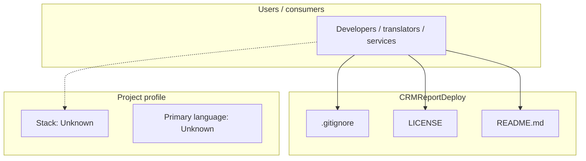
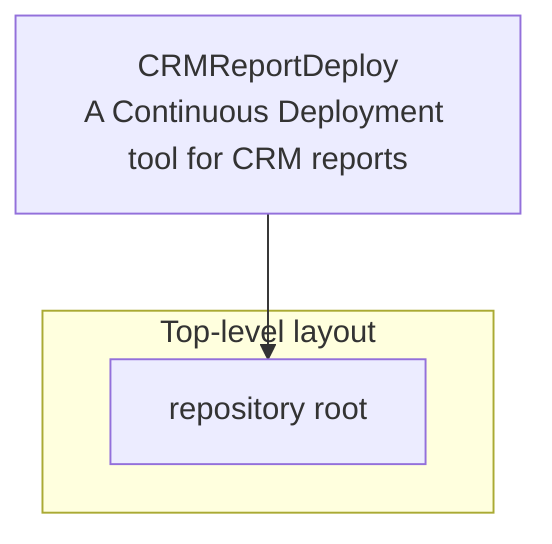
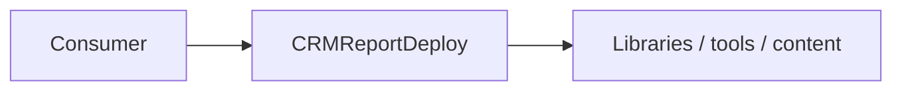

# CRMReportDeploy architecture

[WycliffeAssociates/CRMReportDeploy](https://github.com/WycliffeAssociates/CRMReportDeploy) — A Continuous Deployment tool for CRM reports.

A Continuous Deployment tool for CRM reports

## System context

## Repository structure

**Notable files:** `.gitignore`, `LICENSE`, `README.md`

## Runtime / integration sketch

> This diagram is inferred from repository layout, languages, and README. It is a starting map, not a full design review.

## Languages

| Language | Approx. file count |
|----------|-------------------|
| — | — |

## Design notes

| Topic | Detail |
|--------|--------|
| **Stack** | Unknown |
| **Default branch** | `master` |
| **Org** | WycliffeAssociates |

## Related

- Source: [WycliffeAssociates/CRMReportDeploy](https://github.com/WycliffeAssociates/CRMReportDeploy)
- Branch analyzed: `master`
