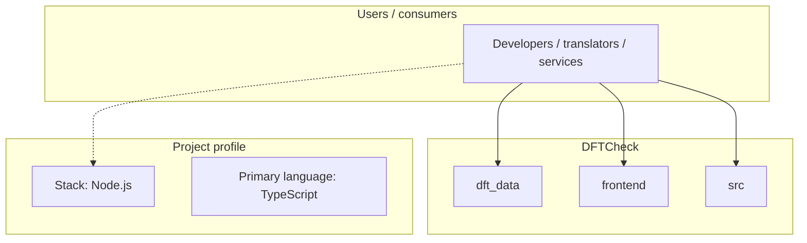
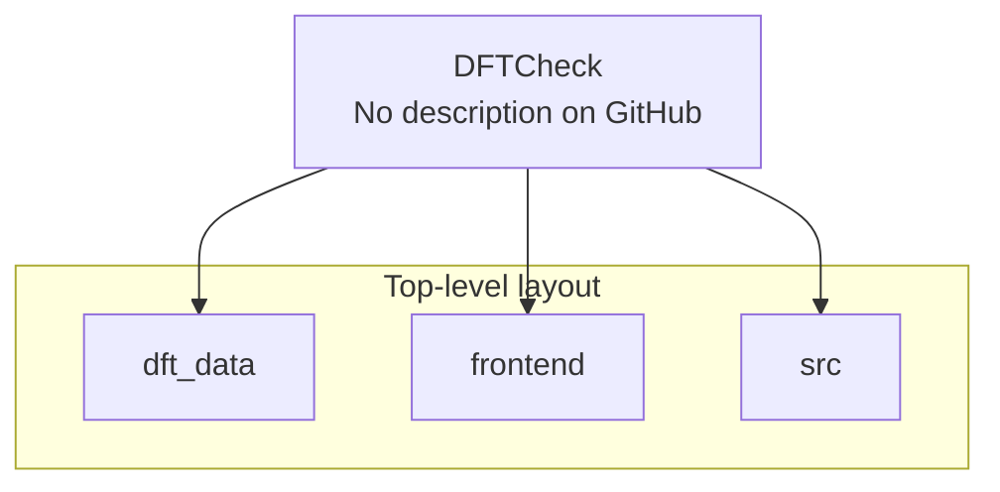
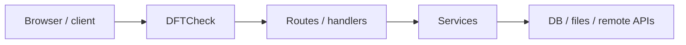

# DFTCheck architecture

[WycliffeAssociates/DFTCheck](https://github.com/WycliffeAssociates/DFTCheck) — _no GitHub description_.

DFTCheck is a public repository under WycliffeAssociates.

## System context

## Repository structure

**Directories:** `dft_data`, `frontend`, `src`

**Notable files:** `.gitattributes`, `.gitignore`, `LICENSE`, `package-lock.json`, `package.json`, `pnpm-lock.yaml`, `README.md`, `tsconfig.json`, `tsconfig.node.json`, `vite.config.ts`

## Runtime / integration sketch

> This diagram is inferred from repository layout, languages, and README. It is a starting map, not a full design review.

## Languages

| Language | Approx. file count |
|----------|-------------------|
| TypeScript | 5 files |
| Python | 3 files |
| HTML | 1 files |
| CSS | 1 files |
| YAML | 1 files |

## Design notes

| Topic | Detail |
|--------|--------|
| **Stack** | Node.js |
| **Default branch** | `main` |
| **Org** | WycliffeAssociates |

## Related

- Source: [WycliffeAssociates/DFTCheck](https://github.com/WycliffeAssociates/DFTCheck)
- Branch analyzed: `main`
