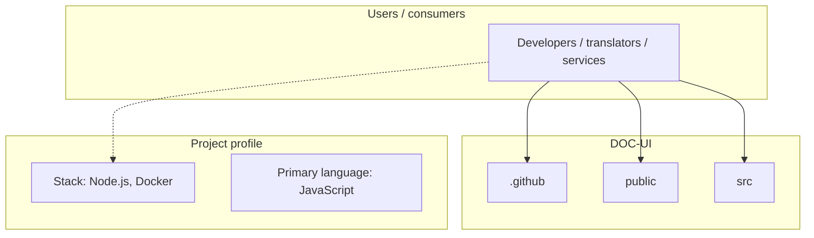
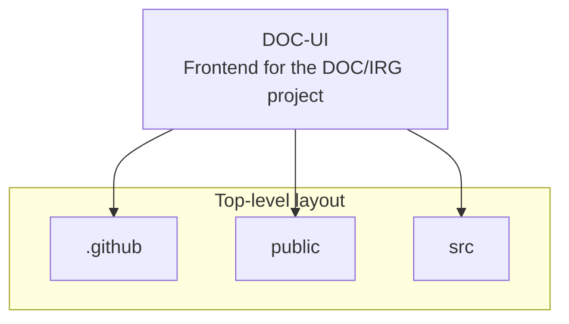
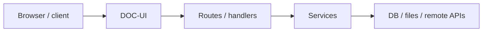

# DOC-UI architecture

[WycliffeAssociates/DOC-UI](https://github.com/WycliffeAssociates/DOC-UI) — Frontend for the DOC/IRG project.

This is UI code to provide a front end to the document python module backend.

## System context

## Repository structure

**Directories:** `.github`, `public`, `src`

**Notable files:** `.dockerignore`, `.gitignore`, `.prettierrc.js`, `Dockerfile`, `jest.config.js`, `jest.setup.js`, `nginx-backend-not-found.conf`, `nginx.conf`, `package-lock.json`, `package.json`, `README.md`, `snowpack.config.json`

## Runtime / integration sketch

> This diagram is inferred from repository layout, languages, and README. It is a starting map, not a full design review.

## Languages

| Language | Approx. file count |
|----------|-------------------|
| JavaScript | 4 files |
| HTML | 1 files |
| Svelte | 1 files |

## Design notes

| Topic | Detail |
|--------|--------|
| **Stack** | Node.js, Docker |
| **Default branch** | `develop` |
| **Org** | WycliffeAssociates |

## Related

- Source: [WycliffeAssociates/DOC-UI](https://github.com/WycliffeAssociates/DOC-UI)
- Branch analyzed: `develop`
