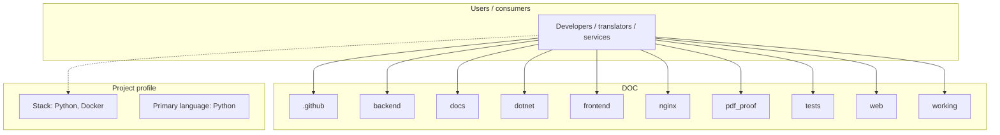
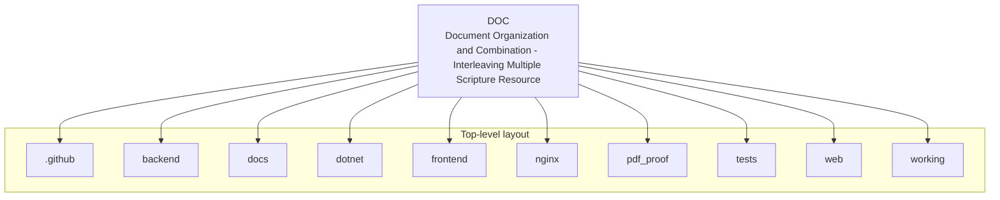
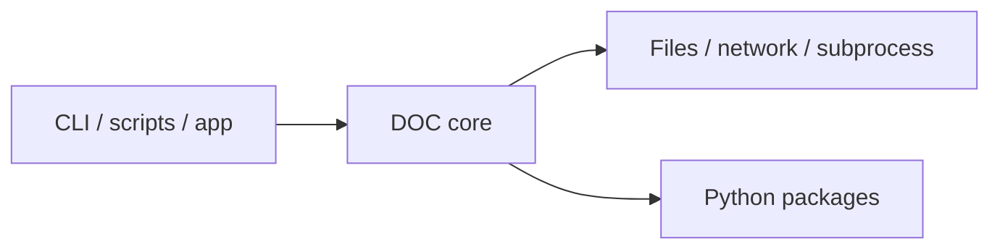

# DOC architecture

[WycliffeAssociates/DOC](https://github.com/WycliffeAssociates/DOC) — Document Organization and Combination - Interleaving Multiple Scripture Resources Backend and Frontend.

A DocumentRequest, composed of ResourceRequests, and a few other values, is submitted to the API. The API then uses that information to fetch assets associated with each Resource and interleaves said assets according to the assembly strategy chosen. It also builds interlinking between assets within the document as appropriate and then translates the assets into an HTML document. Finally the API generates a PDF, ePub, or Docx from the HTML document if requested.

## System context

## Repository structure

**Directories:** `.github`, `backend`, `docs`, `dotnet`, `frontend`, `nginx`, `pdf_proof`, `tests`, `web`, `working`

**Notable files:** `.dockerignore`, `.env`, `.gitignore`, `.gitmodules`, `docker-compose.api-docx-test.yml`, `docker-compose.api-test.yml`, `docker-compose.frontend-test.yml`, `docker-compose.override.yml`, `docker-compose.yml`, `Dockerfile`, `en_ot_survey_rg1_gen_deu.docx`, `en_ot_survey_rg2_jos_est.docx`, `en_ot_survey_rg3_job_sng.docx`, `en_ot_survey_rg4_isa_mal.docx`, `en_rg_nt_survey.docx`, `language_codes.json`, `LICENSE`, `Makefile`, `mypy.ini`, `pyproject.toml`

## Runtime / integration sketch

> This diagram is inferred from repository layout, languages, and README. It is a starting map, not a full design review.

## Languages

| Language | Approx. file count |
|----------|-------------------|
| Python | 96 files |
| Svelte | 83 files |
| TypeScript | 45 files |
| HTML | 14 files |
| YAML | 11 files |
| C# | 1 files |
| JavaScript | 1 files |

## Design notes

| Topic | Detail |
|--------|--------|
| **Stack** | Python, Docker |
| **Default branch** | `doc.bibleineverylanguage.org` |
| **Org** | WycliffeAssociates |

## Related

- Source: [WycliffeAssociates/DOC](https://github.com/WycliffeAssociates/DOC)
- Branch analyzed: `doc.bibleineverylanguage.org`
