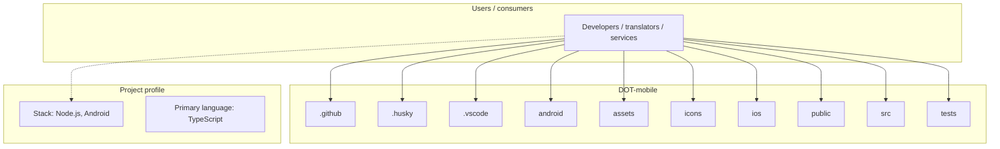
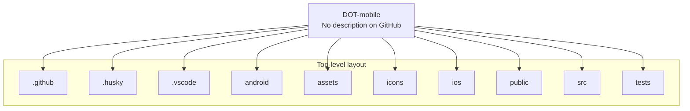
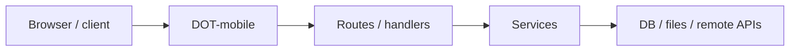

# DOT-mobile architecture

[WycliffeAssociates/DOT-mobile](https://github.com/WycliffeAssociates/DOT-mobile) — _no GitHub description_.

DOT-mobile is a public repository under WycliffeAssociates.

## System context

## Repository structure

**Directories:** `.github`, `.husky`, `.vscode`, `android`, `assets`, `icons`, `ios`, `public`, `src`, `tests`

**Notable files:** `.browserslistrc`, `.eslintrc.cjs`, `.gitignore`, `biome.json`, `capacitor.config.ts`, `eslint.config.js`, `index.html`, `ionic.config.json`, `package-lock.json`, `package.json`, `playwright.config.ts`, `tsconfig.json`, `tsconfig.node.json`, `uno.config.ts`, `vite.config.ts`

## Runtime / integration sketch

> This diagram is inferred from repository layout, languages, and README. It is a starting map, not a full design review.

## Languages

| Language | Approx. file count |
|----------|-------------------|
| TypeScript | 31 files |
| XML | 10 files |
| Gradle | 6 files |
| CSS | 4 files |
| Java | 3 files |
| JavaScript | 2 files |
| Batch | 1 files |
| HTML | 1 files |

## Design notes

| Topic | Detail |
|--------|--------|
| **Stack** | Node.js, Android |
| **Default branch** | `master` |
| **Org** | WycliffeAssociates |

## Related

- Source: [WycliffeAssociates/DOT-mobile](https://github.com/WycliffeAssociates/DOT-mobile)
- Branch analyzed: `master`
