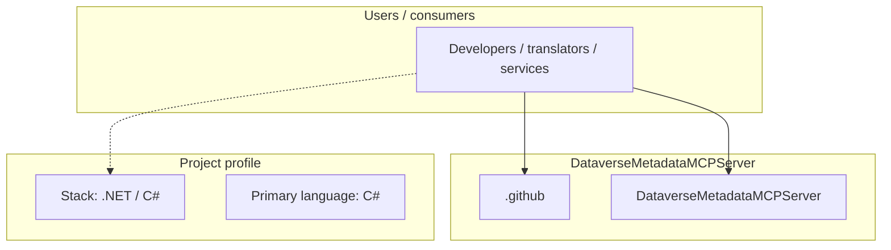
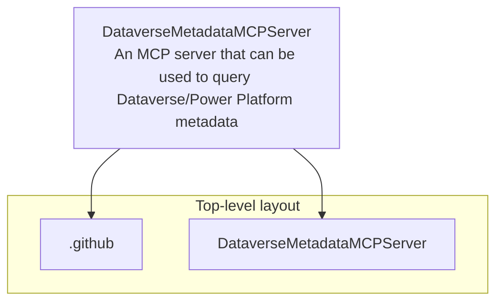
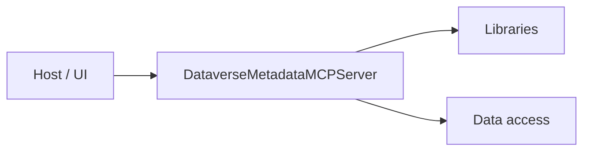

# DataverseMetadataMCPServer architecture

[WycliffeAssociates/DataverseMetadataMCPServer](https://github.com/WycliffeAssociates/DataverseMetadataMCPServer) — An MCP server that can be used to query Dataverse/Power Platform metadata.

An MCP (Model Context Protocol) server that provides tools for querying Microsoft Dataverse/Power Platform metadata. This server allows AI assistants like GitHub Copilot to interact with Dataverse environments to retrieve entity and attribute metadata.

## System context

## Repository structure

**Directories:** `.github`, `DataverseMetadataMCPServer`

**Notable files:** `.gitignore`, `DataverseMetadataMCPServer.sln`, `LICENSE`, `README.md`

## Runtime / integration sketch

> This diagram is inferred from repository layout, languages, and README. It is a starting map, not a full design review.

## Languages

| Language | Approx. file count |
|----------|-------------------|
| C# | 2 files |

## Design notes

| Topic | Detail |
|--------|--------|
| **Stack** | .NET / C# |
| **Default branch** | `master` |
| **Org** | WycliffeAssociates |

## Related

- Source: [WycliffeAssociates/DataverseMetadataMCPServer](https://github.com/WycliffeAssociates/DataverseMetadataMCPServer)
- Branch analyzed: `master`
