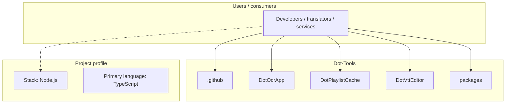
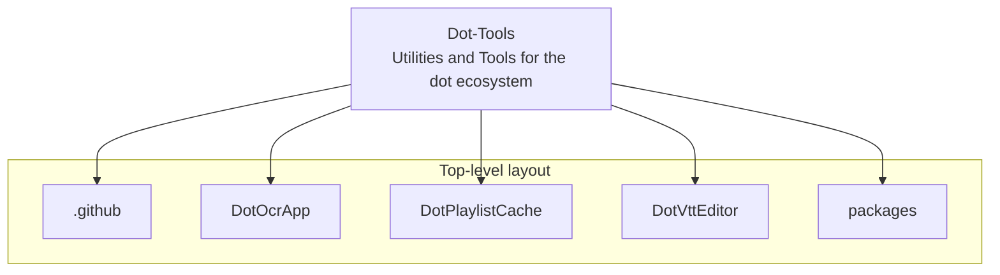
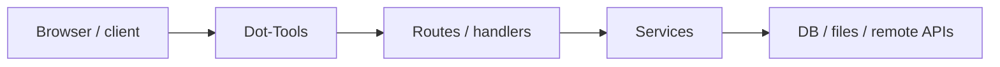

# Dot-Tools architecture

[WycliffeAssociates/Dot-Tools](https://github.com/WycliffeAssociates/Dot-Tools) — Utilities and Tools for the dot ecosystem.

Utilities and Tools for the dot ecosystem

## System context

## Repository structure

**Directories:** `.github`, `DotOcrApp`, `DotPlaylistCache`, `DotVttEditor`, `packages`

**Notable files:** `.gitignore`, `.oxfmtrc.json`, `.oxlintrc.json`, `mise.toml`, `package.json`, `pnpm-lock.yaml`, `pnpm-workspace.yaml`, `README.md`, `tsconfig.base.json`, `vitest.workspace.ts`

## Runtime / integration sketch

> This diagram is inferred from repository layout, languages, and README. It is a starting map, not a full design review.

## Languages

| Language | Approx. file count |
|----------|-------------------|
| TypeScript | 78 files |
| YAML | 4 files |
| XML | 1 files |
| CSS | 1 files |

## Design notes

| Topic | Detail |
|--------|--------|
| **Stack** | Node.js |
| **Default branch** | `master` |
| **Org** | WycliffeAssociates |

## Related

- Source: [WycliffeAssociates/Dot-Tools](https://github.com/WycliffeAssociates/Dot-Tools)
- Branch analyzed: `master`
