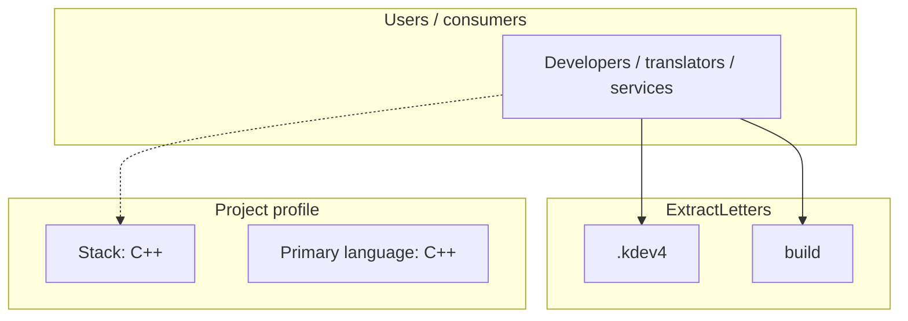
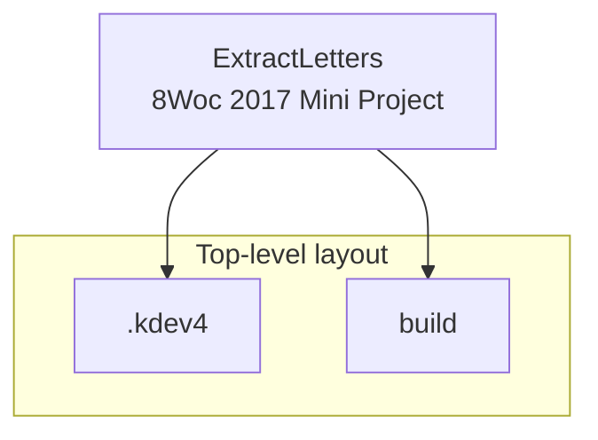
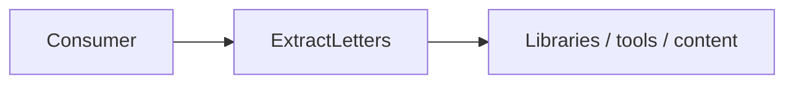

# ExtractLetters architecture

[WycliffeAssociates/ExtractLetters](https://github.com/WycliffeAssociates/ExtractLetters) — 8Woc 2017 Mini Project.

8Woc 2017 Mini Project

## System context

## Repository structure

**Directories:** `.kdev4`, `build`

**Notable files:** `.gitattributes`, `.gitignore`, `CMakeLists.txt`, `ExtractLetters.kdev4`, `json.hpp`, `main.cpp`

## Runtime / integration sketch

> This diagram is inferred from repository layout, languages, and README. It is a starting map, not a full design review.

## Languages

| Language | Approx. file count |
|----------|-------------------|
| C++ | 3 files |
| C | 2 files |

## Design notes

| Topic | Detail |
|--------|--------|
| **Stack** | C++ |
| **Default branch** | `master` |
| **Org** | WycliffeAssociates |

## Related

- Source: [WycliffeAssociates/ExtractLetters](https://github.com/WycliffeAssociates/ExtractLetters)
- Branch analyzed: `master`
