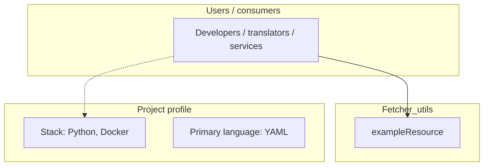
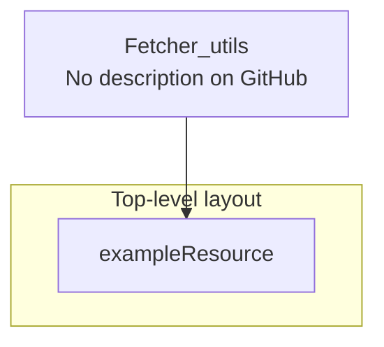
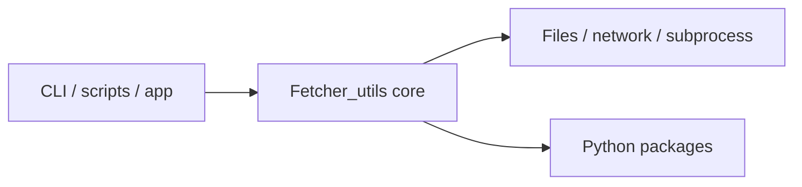

# Fetcher_utils architecture

[WycliffeAssociates/Fetcher_utils](https://github.com/WycliffeAssociates/Fetcher_utils) — _no GitHub description_.

Just a little utility needed to do some plumbing between audio on cdn produced by fetcher and azure service bus

## System context

## Repository structure

**Directories:** `exampleResource`

**Notable files:** `.dockerignore`, `.env`, `.gitignore`, `book_catalog.json`, `docker-compose.yml`, `dockerfile`, `main.py`, `makefile`, `readme.md`, `requirements.txt`, `run.sh`

## Runtime / integration sketch

> This diagram is inferred from repository layout, languages, and README. It is a starting map, not a full design review.

## Languages

| Language | Approx. file count |
|----------|-------------------|
| YAML | 1 files |
| Python | 1 files |
| Shell | 1 files |

## Design notes

| Topic | Detail |
|--------|--------|
| **Stack** | Python, Docker |
| **Default branch** | `master` |
| **Org** | WycliffeAssociates |

## Related

- Source: [WycliffeAssociates/Fetcher_utils](https://github.com/WycliffeAssociates/Fetcher_utils)
- Branch analyzed: `master`
