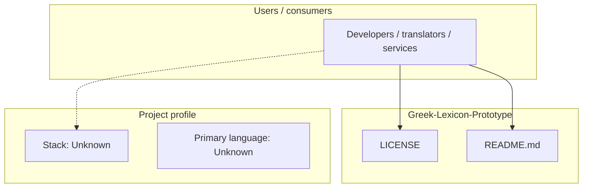
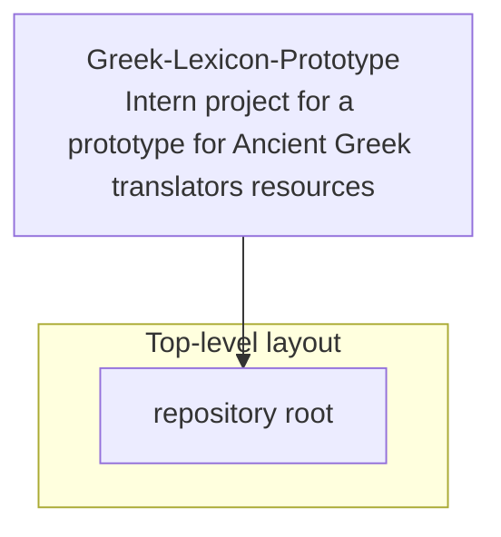
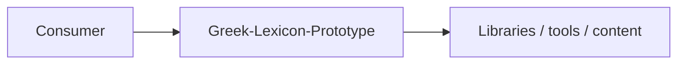

# Greek-Lexicon-Prototype architecture

[WycliffeAssociates/Greek-Lexicon-Prototype](https://github.com/WycliffeAssociates/Greek-Lexicon-Prototype) — Intern project for a prototype for Ancient Greek translators resources.

Intern project for a prototype for Ancient Greek translators resources

## System context

## Repository structure

**Notable files:** `LICENSE`, `README.md`

## Runtime / integration sketch

> This diagram is inferred from repository layout, languages, and README. It is a starting map, not a full design review.

## Languages

| Language | Approx. file count |
|----------|-------------------|
| — | — |

## Design notes

| Topic | Detail |
|--------|--------|
| **Stack** | Unknown |
| **Default branch** | `master` |
| **Org** | WycliffeAssociates |

## Related

- Source: [WycliffeAssociates/Greek-Lexicon-Prototype](https://github.com/WycliffeAssociates/Greek-Lexicon-Prototype)
- Branch analyzed: `master`
