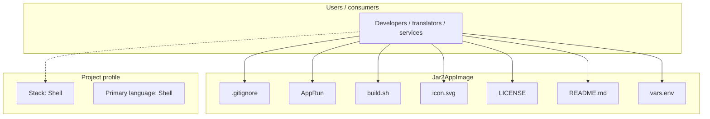
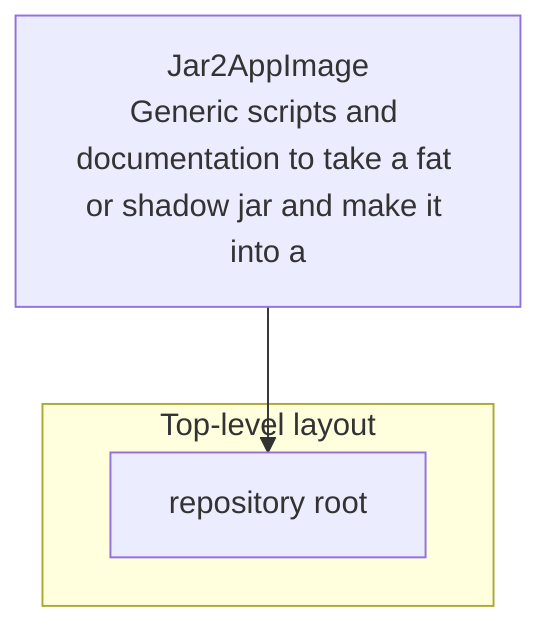

# Jar2AppImage architecture

[WycliffeAssociates/Jar2AppImage](https://github.com/WycliffeAssociates/Jar2AppImage) — Generic scripts and documentation to take a fat or shadow jar and make it into a linux AppImage.

Generic scripts and documentation to take a jdk11 fat or shadow jar and make it into a linux AppImage bundled with a jdk11 jre. Uses [linuxdeploy](https://github.com/linuxdeploy/linuxdeploy) and [AdoptOpenJDK 11](https://github.com/AdoptOpenJDK/openjdk11-binaries)

## System context

## Repository structure

**Notable files:** `.gitignore`, `AppRun`, `build.sh`, `icon.svg`, `LICENSE`, `README.md`, `vars.env`

## Runtime / integration sketch

> This diagram is inferred from repository layout, languages, and README. It is a starting map, not a full design review.

## Languages

| Language | Approx. file count |
|----------|-------------------|
| Shell | 1 files |

## Design notes

| Topic | Detail |
|--------|--------|
| **Stack** | Shell |
| **Default branch** | `master` |
| **Org** | WycliffeAssociates |

## Related

- Source: [WycliffeAssociates/Jar2AppImage](https://github.com/WycliffeAssociates/Jar2AppImage)
- Branch analyzed: `master`
