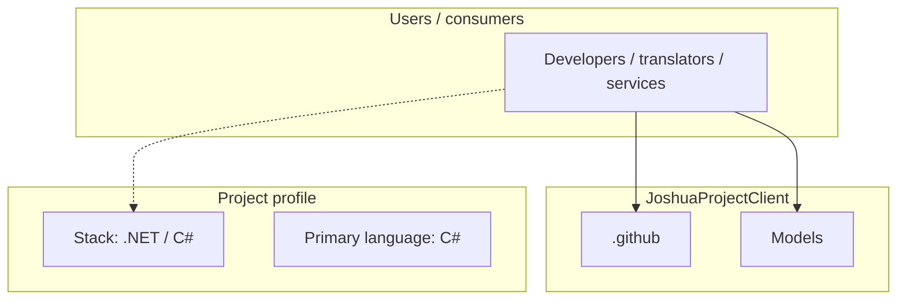
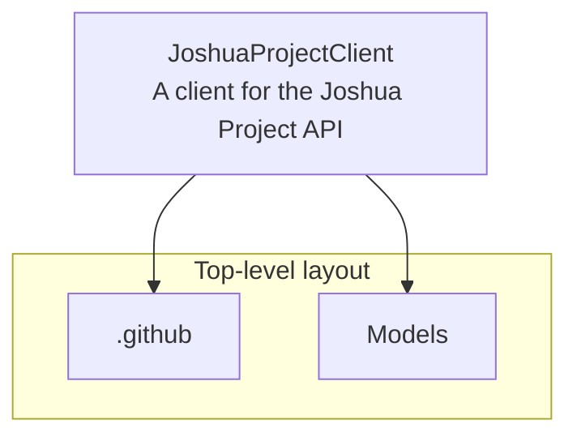
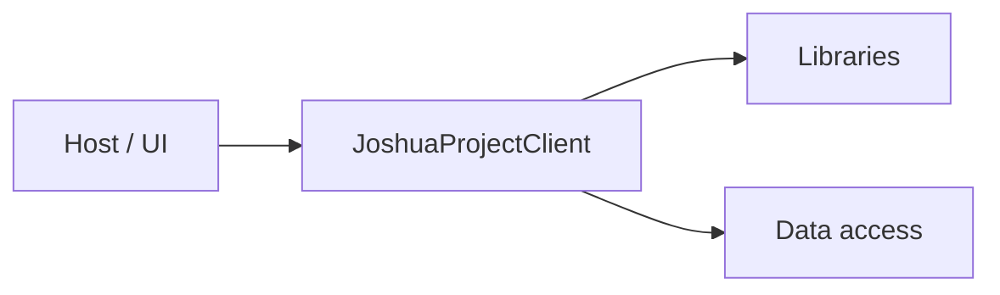

# JoshuaProjectClient architecture

[WycliffeAssociates/JoshuaProjectClient](https://github.com/WycliffeAssociates/JoshuaProjectClient) — A client for the Joshua Project API.

A .NET Standard 2.1 client library for the [Joshua Project API](https://api.joshuaproject.net), providing easy access to data about unreached people groups and languages around the world.

## System context

## Repository structure

**Directories:** `.github`, `Models`

**Notable files:** `.gitignore`, `Client.cs`, `JoshuaProjectClient.csproj`, `LICENSE`, `README.md`

## Runtime / integration sketch

> This diagram is inferred from repository layout, languages, and README. It is a starting map, not a full design review.

## Languages

| Language | Approx. file count |
|----------|-------------------|
| C# | 5 files |

## Design notes

| Topic | Detail |
|--------|--------|
| **Stack** | .NET / C# |
| **Default branch** | `master` |
| **Org** | WycliffeAssociates |

## Related

- Source: [WycliffeAssociates/JoshuaProjectClient](https://github.com/WycliffeAssociates/JoshuaProjectClient)
- Branch analyzed: `master`
