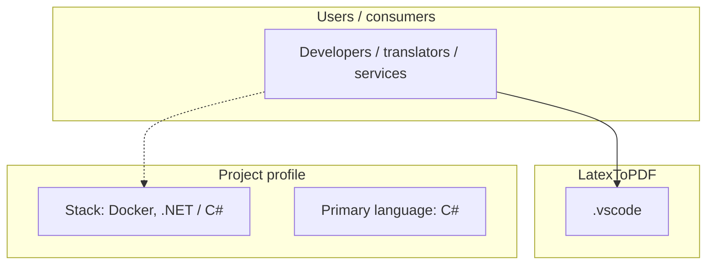
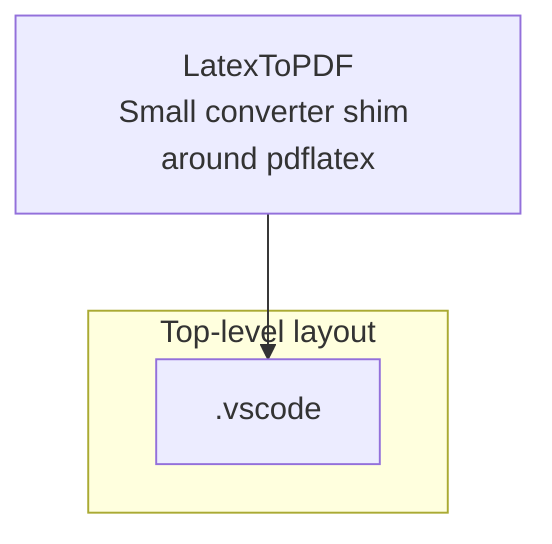
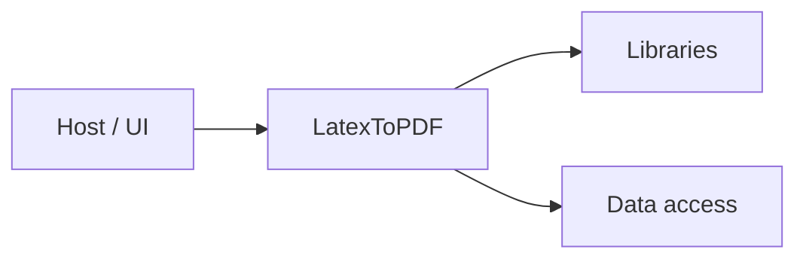

# LatexToPDF architecture

[WycliffeAssociates/LatexToPDF](https://github.com/WycliffeAssociates/LatexToPDF) — Small converter shim around pdflatex.

Small converter shim around pdflatex

## System context

## Repository structure

**Directories:** `.vscode`

**Notable files:** `.dockerignore`, `.gitignore`, `Convert.cs`, `Dockerfile`, `host.json`, `LatexToPdf.csproj`, `LICENSE`, `README.md`

## Runtime / integration sketch

> This diagram is inferred from repository layout, languages, and README. It is a starting map, not a full design review.

## Languages

| Language | Approx. file count |
|----------|-------------------|
| C# | 1 files |

## Design notes

| Topic | Detail |
|--------|--------|
| **Stack** | Docker, .NET / C# |
| **Default branch** | `master` |
| **Org** | WycliffeAssociates |

## Related

- Source: [WycliffeAssociates/LatexToPDF](https://github.com/WycliffeAssociates/LatexToPDF)
- Branch analyzed: `master`
