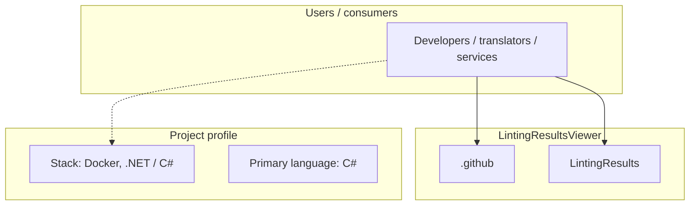
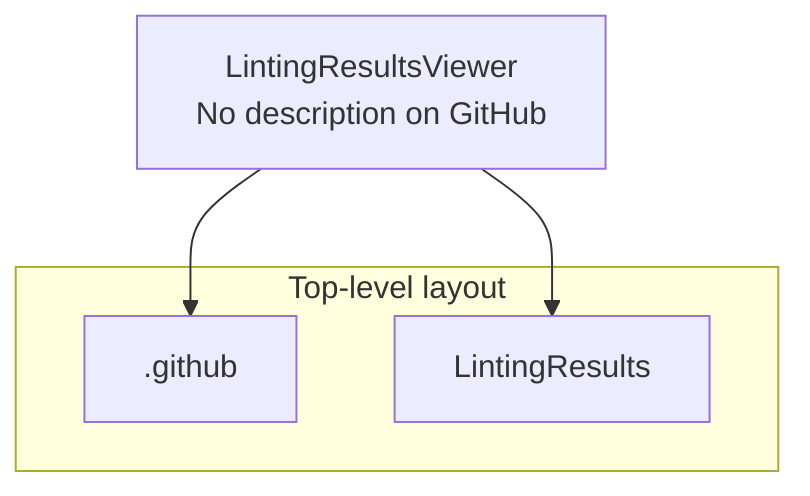
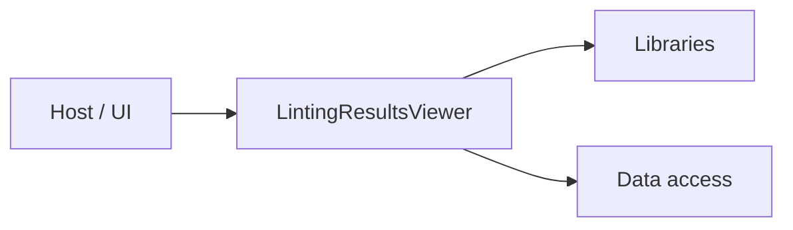

# LintingResultsViewer architecture

[WycliffeAssociates/LintingResultsViewer](https://github.com/WycliffeAssociates/LintingResultsViewer) — _no GitHub description_.

A web application for viewing and managing linting results for repositories. The application provides a user interface to browse linting results and receives new linting data via Azure Service Bus messaging.

## System context

## Repository structure

**Directories:** `.github`, `LintingResults`

**Notable files:** `.dockerignore`, `.gitignore`, `build_push.sh`, `docker-compose.yml`, `LICENSE`, `LintingResults.sln`, `README.md`

## Runtime / integration sketch

> This diagram is inferred from repository layout, languages, and README. It is a starting map, not a full design review.

## Languages

| Language | Approx. file count |
|----------|-------------------|
| C# | 30 files |
| CSS | 1 files |
| Shell | 1 files |
| YAML | 1 files |

## Design notes

| Topic | Detail |
|--------|--------|
| **Stack** | Docker, .NET / C# |
| **Default branch** | `master` |
| **Org** | WycliffeAssociates |

## Related

- Source: [WycliffeAssociates/LintingResultsViewer](https://github.com/WycliffeAssociates/LintingResultsViewer)
- Branch analyzed: `master`
