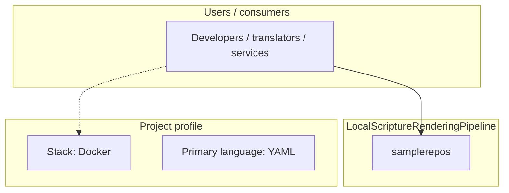
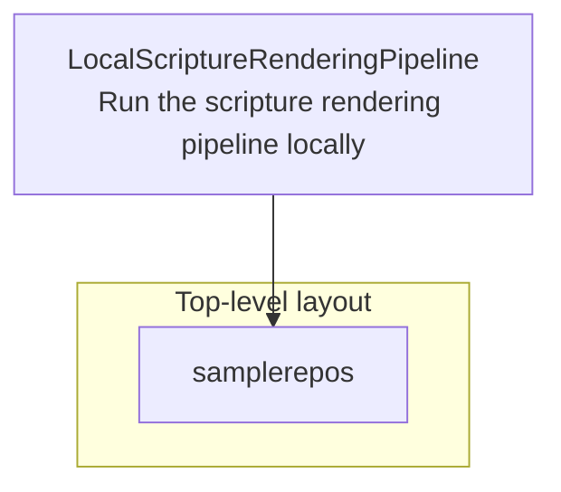
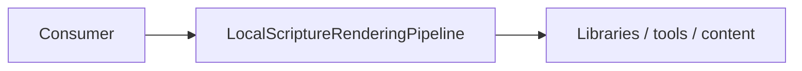

# LocalScriptureRenderingPipeline architecture

[WycliffeAssociates/LocalScriptureRenderingPipeline](https://github.com/WycliffeAssociates/LocalScriptureRenderingPipeline) — Run the scripture rendering pipeline locally.

Run the scripture rendering pipeline locally

## System context

## Repository structure

**Directories:** `samplerepos`

**Notable files:** `.gitignore`, `docker-compose.yml`, `README.md`

## Runtime / integration sketch

> This diagram is inferred from repository layout, languages, and README. It is a starting map, not a full design review.

## Languages

| Language | Approx. file count |
|----------|-------------------|
| YAML | 1 files |

## Design notes

| Topic | Detail |
|--------|--------|
| **Stack** | Docker |
| **Default branch** | `master` |
| **Org** | WycliffeAssociates |

## Related

- Source: [WycliffeAssociates/LocalScriptureRenderingPipeline](https://github.com/WycliffeAssociates/LocalScriptureRenderingPipeline)
- Branch analyzed: `master`
