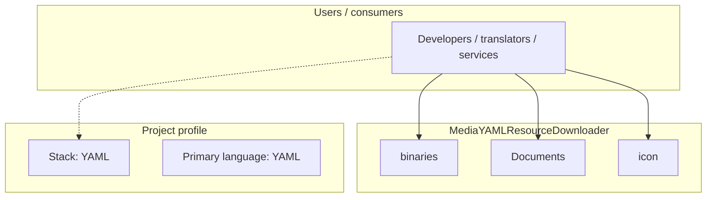
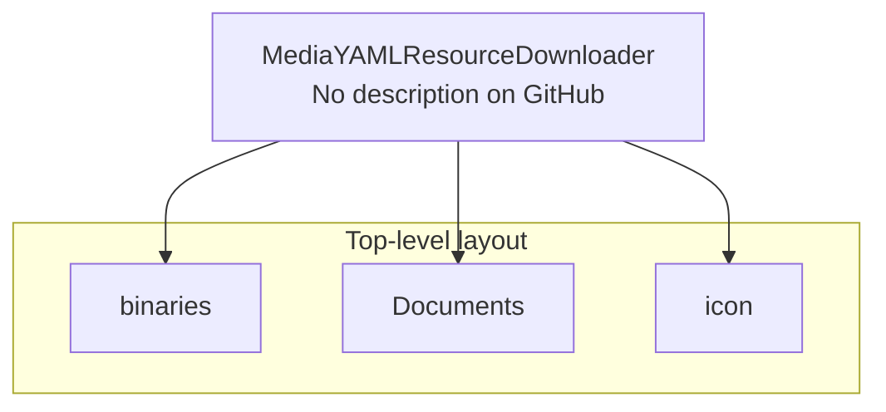

# MediaYAMLResourceDownloader architecture

[WycliffeAssociates/MediaYAMLResourceDownloader](https://github.com/WycliffeAssociates/MediaYAMLResourceDownloader) — _no GitHub description_.

Wycliffe Associates Media YAML Resource Downloader

## System context

## Repository structure

**Directories:** `binaries`, `Documents`, `icon`

**Notable files:** `Media YAML Downloader 0.94.dmg`, `Media_YAML_Downloader0.94.livecode`, `README.md`

## Runtime / integration sketch

> This diagram is inferred from repository layout, languages, and README. It is a starting map, not a full design review.

## Languages

| Language | Approx. file count |
|----------|-------------------|
| YAML | 3 files |

## Design notes

| Topic | Detail |
|--------|--------|
| **Stack** | YAML |
| **Default branch** | `master` |
| **Org** | WycliffeAssociates |

## Related

- Source: [WycliffeAssociates/MediaYAMLResourceDownloader](https://github.com/WycliffeAssociates/MediaYAMLResourceDownloader)
- Branch analyzed: `master`
