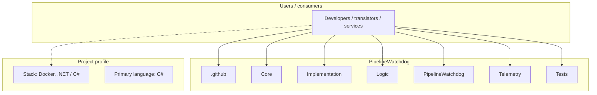
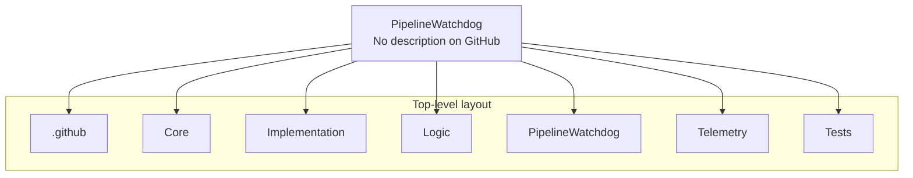
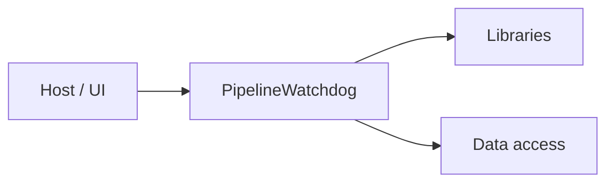

# PipelineWatchdog architecture

[WycliffeAssociates/PipelineWatchdog](https://github.com/WycliffeAssociates/PipelineWatchdog) — _no GitHub description_.

This tool listens to the main rendering pipeline bus and records all of the repos it has seen. It will then on a schedule check all of the repos in WACS against what it has seen and then sends repos to the pipeline again to make sure the creation is handled or the delte is handled.

## System context

## Repository structure

**Directories:** `.github`, `Core`, `Implementation`, `Logic`, `PipelineWatchdog`, `Telemetry`, `Tests`

**Notable files:** `.dockerignore`, `.gitignore`, `docker-compose.yml`, `PipelineWatchdog.sln`, `README.md`

## Runtime / integration sketch

> This diagram is inferred from repository layout, languages, and README. It is a starting map, not a full design review.

## Languages

| Language | Approx. file count |
|----------|-------------------|
| C# | 21 files |
| YAML | 1 files |

## Design notes

| Topic | Detail |
|--------|--------|
| **Stack** | Docker, .NET / C# |
| **Default branch** | `master` |
| **Org** | WycliffeAssociates |

## Related

- Source: [WycliffeAssociates/PipelineWatchdog](https://github.com/WycliffeAssociates/PipelineWatchdog)
- Branch analyzed: `master`
