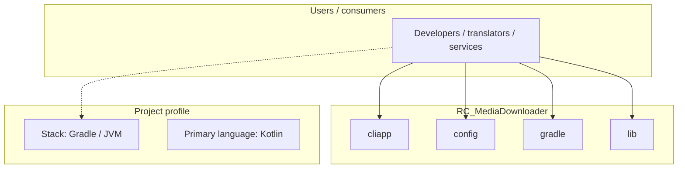
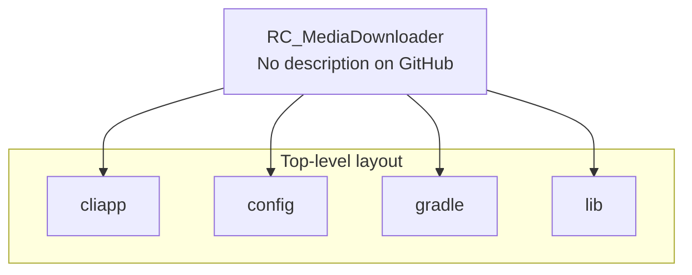
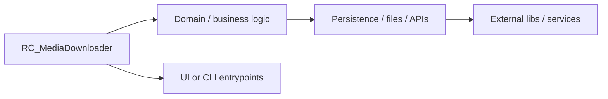

# RC_MediaDownloader architecture

[WycliffeAssociates/RC_MediaDownloader](https://github.com/WycliffeAssociates/RC_MediaDownloader) — _no GitHub description_.

This tool supports downloading media content to the given resource container and update the urls with respect to the resource container itself.

## System context

## Repository structure

**Directories:** `cliapp`, `config`, `gradle`, `lib`

**Notable files:** `.gitignore`, `.travis.yml`, `build.gradle`, `dependencies.gradle`, `gradle.properties`, `gradlew`, `gradlew.bat`, `LICENSE`, `README.md`, `settings.gradle`, `sonar-project.properties`

## Runtime / integration sketch

> This diagram is inferred from repository layout, languages, and README. It is a starting map, not a full design review.

## Languages

| Language | Approx. file count |
|----------|-------------------|
| Kotlin | 12 files |
| Gradle | 5 files |
| YAML | 1 files |
| Batch | 1 files |

## Design notes

| Topic | Detail |
|--------|--------|
| **Stack** | Gradle / JVM |
| **Default branch** | `master` |
| **Org** | WycliffeAssociates |

## Related

- Source: [WycliffeAssociates/RC_MediaDownloader](https://github.com/WycliffeAssociates/RC_MediaDownloader)
- Branch analyzed: `master`
