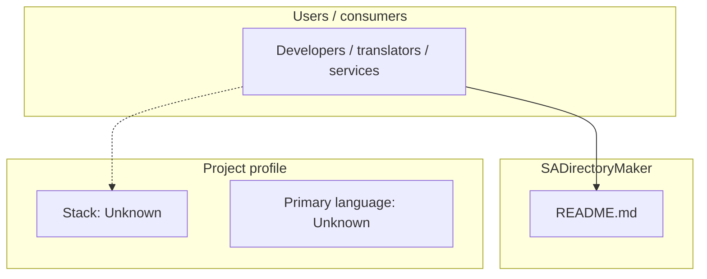
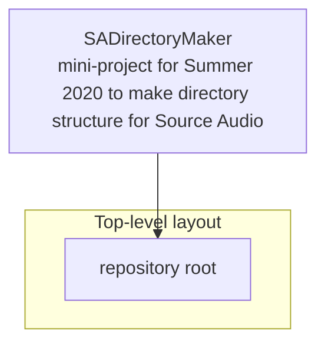

# SADirectoryMaker architecture

[WycliffeAssociates/SADirectoryMaker](https://github.com/WycliffeAssociates/SADirectoryMaker) — mini-project for Summer 2020 to make directory structure for Source Audio.

mini-project for Summer 2020 to make directory structure for Source Audio

## System context

## Repository structure

**Notable files:** `README.md`

## Runtime / integration sketch

> This diagram is inferred from repository layout, languages, and README. It is a starting map, not a full design review.

## Languages

| Language | Approx. file count |
|----------|-------------------|
| — | — |

## Design notes

| Topic | Detail |
|--------|--------|
| **Stack** | Unknown |
| **Default branch** | `master` |
| **Org** | WycliffeAssociates |

## Related

- Source: [WycliffeAssociates/SADirectoryMaker](https://github.com/WycliffeAssociates/SADirectoryMaker)
- Branch analyzed: `master`
