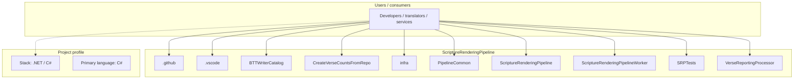
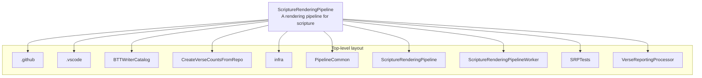
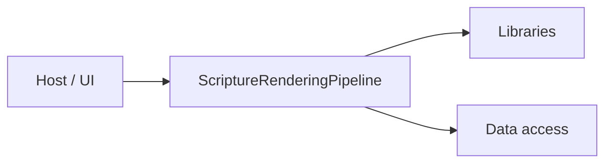

# ScriptureRenderingPipeline architecture

[WycliffeAssociates/ScriptureRenderingPipeline](https://github.com/WycliffeAssociates/ScriptureRenderingPipeline) — A rendering pipeline for scripture.

A rendering pipeline for scripture and BTTWriter catalog

## System context

## Repository structure

**Directories:** `.github`, `.vscode`, `BTTWriterCatalog`, `CreateVerseCountsFromRepo`, `infra`, `PipelineCommon`, `ScriptureRenderingPipeline`, `ScriptureRenderingPipelineWorker`, `SRPTests`, `VerseReportingProcessor`

**Notable files:** `.dockerignore`, `.gitignore`, `LICENSE`, `README.md`, `ScriptureRenderingPipeline.sln`

## Runtime / integration sketch

> This diagram is inferred from repository layout, languages, and README. It is a starting map, not a full design review.

## Languages

| Language | Approx. file count |
|----------|-------------------|
| C# | 173 files |
| YAML | 1 files |

## Design notes

| Topic | Detail |
|--------|--------|
| **Stack** | .NET / C# |
| **Default branch** | `master` |
| **Org** | WycliffeAssociates |

## Related

- Source: [WycliffeAssociates/ScriptureRenderingPipeline](https://github.com/WycliffeAssociates/ScriptureRenderingPipeline)
- Branch analyzed: `master`
