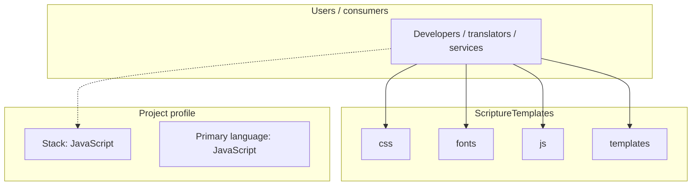
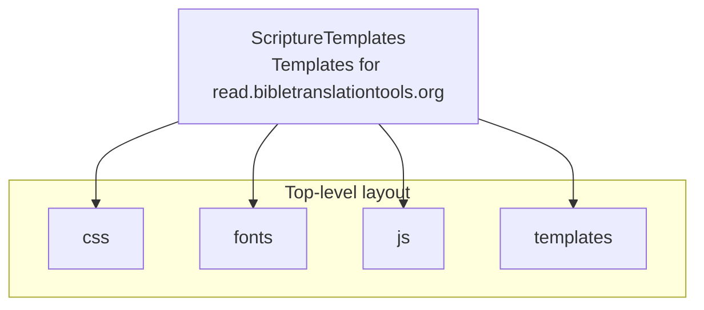
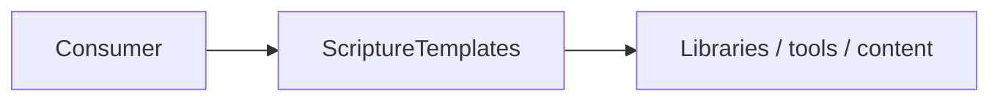

# ScriptureTemplates architecture

[WycliffeAssociates/ScriptureTemplates](https://github.com/WycliffeAssociates/ScriptureTemplates) — Templates for read.bibletranslationtools.org.

Templates for read.bibletranslationtools.org

## System context

## Repository structure

**Directories:** `css`, `fonts`, `js`, `templates`

**Notable files:** `LICENSE`, `README.md`

## Runtime / integration sketch

> This diagram is inferred from repository layout, languages, and README. It is a starting map, not a full design review.

## Languages

| Language | Approx. file count |
|----------|-------------------|
| JavaScript | 27 files |
| CSS | 13 files |
| HTML | 6 files |
| TypeScript | 1 files |

## Design notes

| Topic | Detail |
|--------|--------|
| **Stack** | JavaScript |
| **Default branch** | `master` |
| **Org** | WycliffeAssociates |

## Related

- Source: [WycliffeAssociates/ScriptureTemplates](https://github.com/WycliffeAssociates/ScriptureTemplates)
- Branch analyzed: `master`
