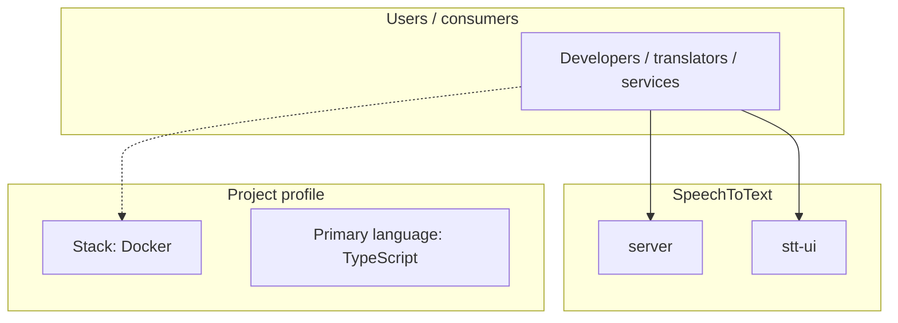
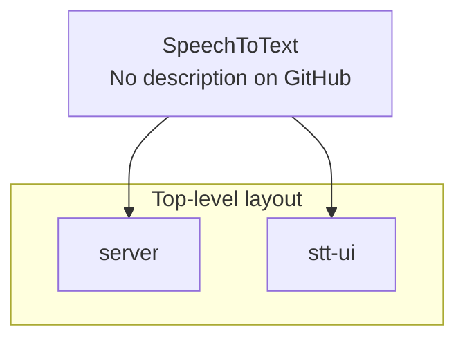
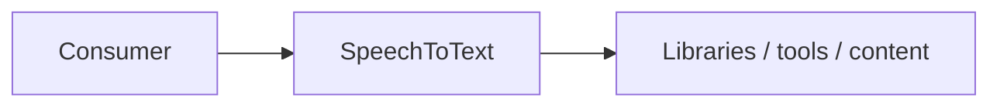

# SpeechToText architecture

[WycliffeAssociates/SpeechToText](https://github.com/WycliffeAssociates/SpeechToText) — _no GitHub description_.

SpeechToText is a public repository under WycliffeAssociates.

## System context

## Repository structure

**Directories:** `server`, `stt-ui`

**Notable files:** `.gitignore`, `docker-compose.yml`, `run.sh`

## Runtime / integration sketch

> This diagram is inferred from repository layout, languages, and README. It is a starting map, not a full design review.

## Languages

| Language | Approx. file count |
|----------|-------------------|
| TypeScript | 5 files |
| JavaScript | 3 files |
| YAML | 2 files |
| Python | 2 files |
| CSS | 2 files |
| Shell | 1 files |
| HTML | 1 files |

## Design notes

| Topic | Detail |
|--------|--------|
| **Stack** | Docker |
| **Default branch** | `master` |
| **Org** | WycliffeAssociates |

## Related

- Source: [WycliffeAssociates/SpeechToText](https://github.com/WycliffeAssociates/SpeechToText)
- Branch analyzed: `master`
