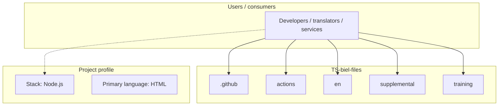
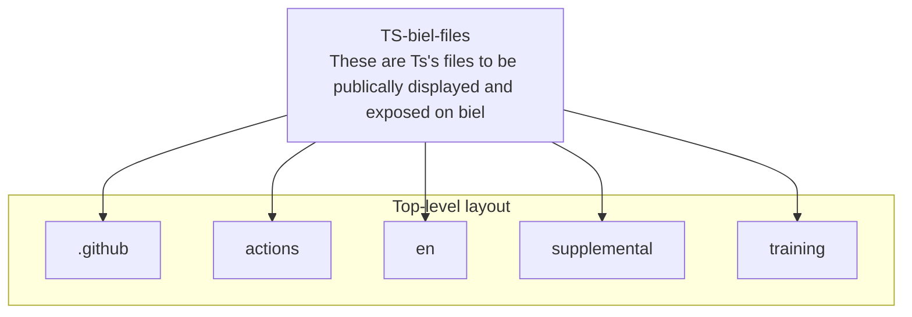
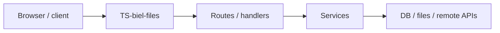

# TS-biel-files architecture

[WycliffeAssociates/TS-biel-files](https://github.com/WycliffeAssociates/TS-biel-files) — These are Ts's files to be publically displayed and exposed on biel.

These are Ts's files to be publically displayed and exposed on biel

## System context

## Repository structure

**Directories:** `.github`, `actions`, `en`, `supplemental`, `training`

**Notable files:** `.gitignore`, `localizations.json`, `metadata.json`, `package-lock.json`, `package.json`

## Runtime / integration sketch

> This diagram is inferred from repository layout, languages, and README. It is a starting map, not a full design review.

## Languages

| Language | Approx. file count |
|----------|-------------------|
| HTML | 6 files |
| YAML | 2 files |
| JavaScript | 2 files |

## Design notes

| Topic | Detail |
|--------|--------|
| **Stack** | Node.js |
| **Default branch** | `master` |
| **Org** | WycliffeAssociates |

## Related

- Source: [WycliffeAssociates/TS-biel-files](https://github.com/WycliffeAssociates/TS-biel-files)
- Branch analyzed: `master`
