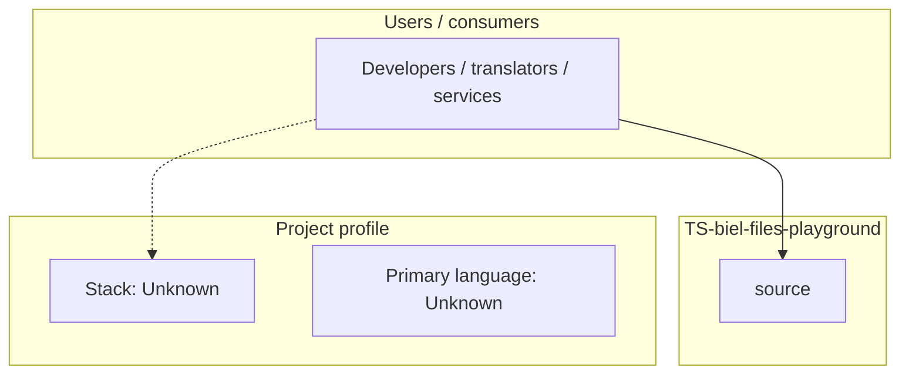
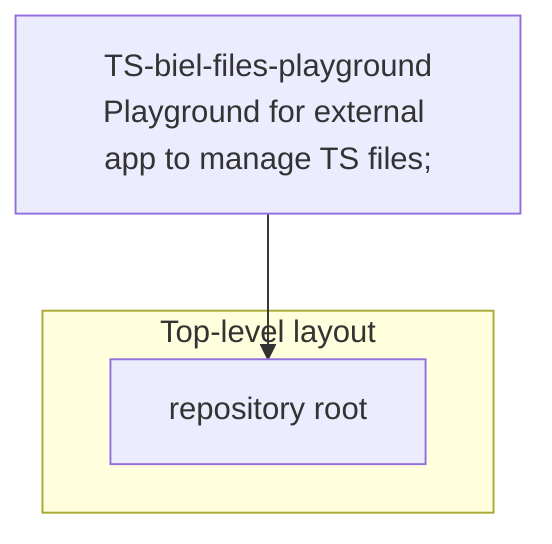

# TS-biel-files-playground architecture

[WycliffeAssociates/TS-biel-files-playground](https://github.com/WycliffeAssociates/TS-biel-files-playground) — Playground for external app to manage TS files;.

Playground for external app to manage TS files;

## System context

## Repository structure

## Runtime / integration sketch

> This diagram is inferred from repository layout, languages, and README. It is a starting map, not a full design review.

## Languages

| Language | Approx. file count |
|----------|-------------------|
| — | — |

## Design notes

| Topic | Detail |
|--------|--------|
| **Stack** | Unknown |
| **Default branch** | `master` |
| **Org** | WycliffeAssociates |

## Related

- Source: [WycliffeAssociates/TS-biel-files-playground](https://github.com/WycliffeAssociates/TS-biel-files-playground)
- Branch analyzed: `master`
