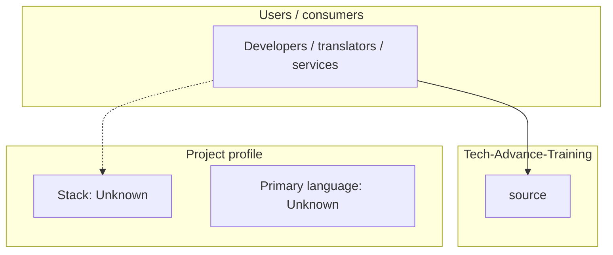
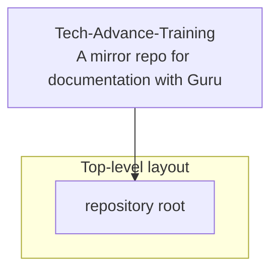
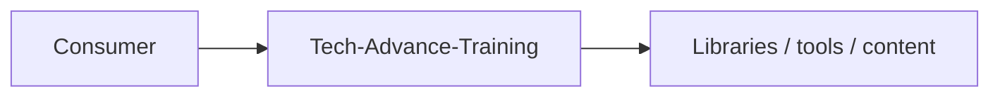

# Tech-Advance-Training architecture

[WycliffeAssociates/Tech-Advance-Training](https://github.com/WycliffeAssociates/Tech-Advance-Training) — A mirror repo for documentation with Guru.

A mirror repo for documentation with Guru

## System context

## Repository structure

## Runtime / integration sketch

> This diagram is inferred from repository layout, languages, and README. It is a starting map, not a full design review.

## Languages

| Language | Approx. file count |
|----------|-------------------|
| — | — |

## Design notes

| Topic | Detail |
|--------|--------|
| **Stack** | Unknown |
| **Default branch** | `autosync` |
| **Org** | WycliffeAssociates |

## Related

- Source: [WycliffeAssociates/Tech-Advance-Training](https://github.com/WycliffeAssociates/Tech-Advance-Training)
- Branch analyzed: `autosync`
