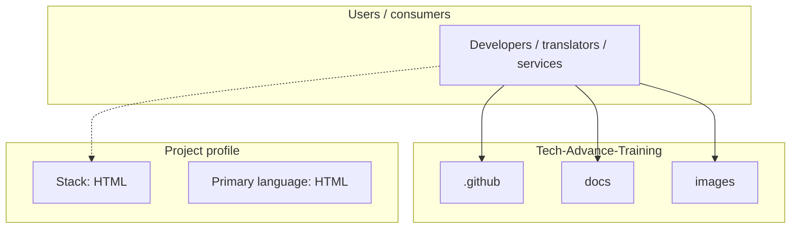
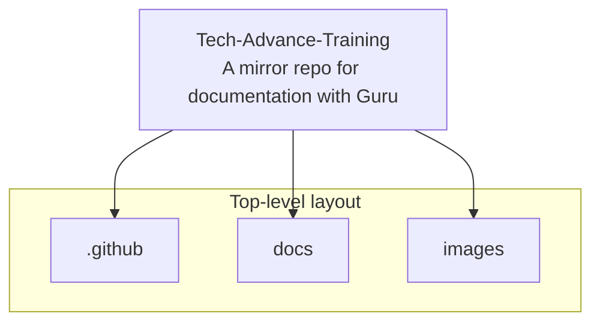
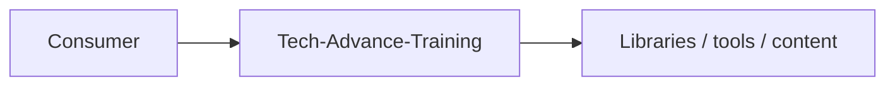

# Tech-Advance-Training architecture

[WycliffeAssociates/Tech-Advance-Training](https://github.com/WycliffeAssociates/Tech-Advance-Training) — A mirror repo for documentation with Guru.

A mirror repo for documentation with Guru

## System context

## Repository structure

**Directories:** `.github`, `docs`, `images`

**Notable files:** `.gitignore`, `comments.json`, `README.md`, `readthedocs.yaml`

## Runtime / integration sketch

> This diagram is inferred from repository layout, languages, and README. It is a starting map, not a full design review.

## Languages

| Language | Approx. file count |
|----------|-------------------|
| HTML | 82 files |
| JavaScript | 11 files |
| CSS | 4 files |
| Python | 1 files |
| Batch | 1 files |
| YAML | 1 files |

## Design notes

| Topic | Detail |
|--------|--------|
| **Stack** | HTML |
| **Default branch** | `autosync` |
| **Org** | WycliffeAssociates |

## Related

- Source: [WycliffeAssociates/Tech-Advance-Training](https://github.com/WycliffeAssociates/Tech-Advance-Training)
- Branch analyzed: `autosync`
