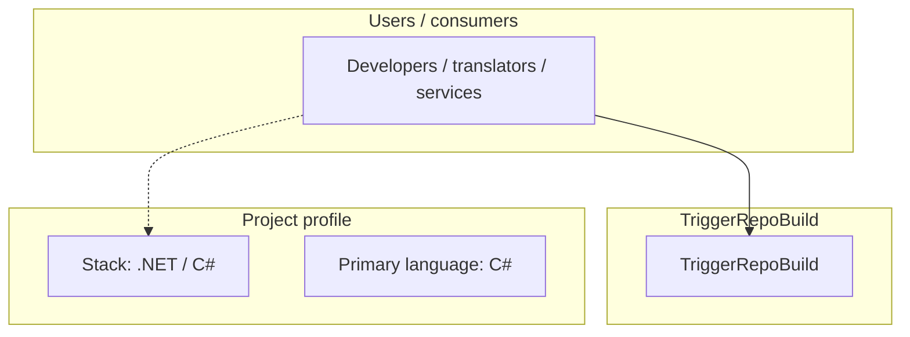
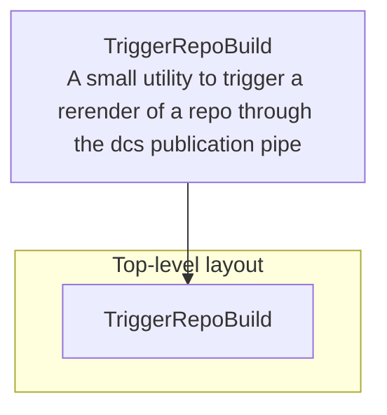
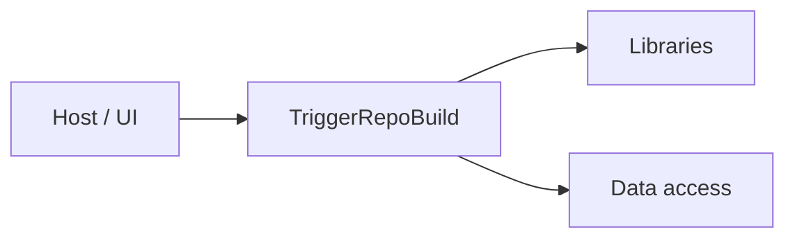

# TriggerRepoBuild architecture

[WycliffeAssociates/TriggerRepoBuild](https://github.com/WycliffeAssociates/TriggerRepoBuild) — A small utility to trigger a rerender of a repo through the dcs publication pipeline.

The standard .net core build either download the dotnet sdk and run dotnet build or use Visual Studio

## System context

## Repository structure

**Directories:** `TriggerRepoBuild`

**Notable files:** `.gitignore`, `README.md`, `TriggerRepoBuild.sln`

## Runtime / integration sketch

> This diagram is inferred from repository layout, languages, and README. It is a starting map, not a full design review.

## Languages

| Language | Approx. file count |
|----------|-------------------|
| C# | 7 files |

## Design notes

| Topic | Detail |
|--------|--------|
| **Stack** | .NET / C# |
| **Default branch** | `master` |
| **Org** | WycliffeAssociates |

## Related

- Source: [WycliffeAssociates/TriggerRepoBuild](https://github.com/WycliffeAssociates/TriggerRepoBuild)
- Branch analyzed: `master`
