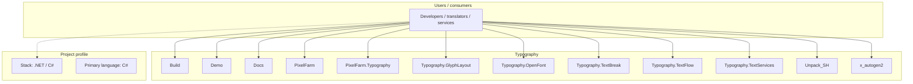
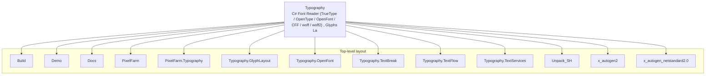
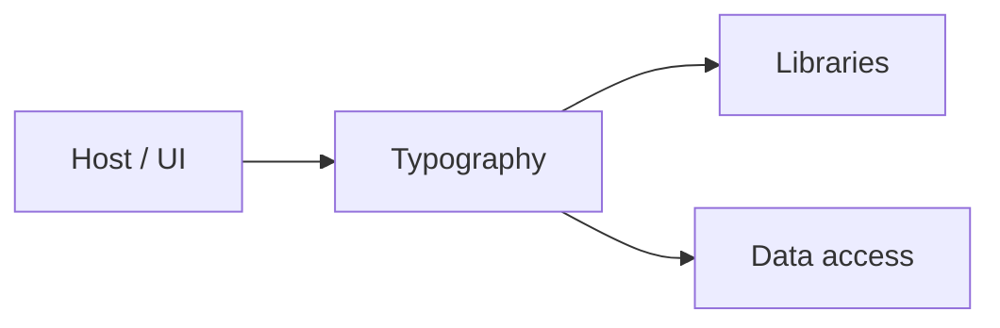

# Typography architecture

[WycliffeAssociates/Typography](https://github.com/WycliffeAssociates/Typography) — C# Font Reader (TrueType / OpenType / OpenFont / CFF / woff / woff2) , Glyphs Layout and Rendering.

===========

## System context

## Repository structure

**Directories:** `Build`, `Demo`, `Docs`, `PixelFarm`, `PixelFarm.Typography`, `Typography.GlyphLayout`, `Typography.OpenFont`, `Typography.TextBreak`, `Typography.TextFlow`, `Typography.TextServices`, `Unpack_SH`, `x_autogen2`, `x_autogen_netstandard2.0`

**Notable files:** `.gitattributes`, `.gitignore`, `LICENSE.md`, `OLD_README.md`, `README.md`, `Typography.sln`

## Runtime / integration sketch

> This diagram is inferred from repository layout, languages, and README. It is a starting map, not a full design review.

## Languages

| Language | Approx. file count |
|----------|-------------------|
| C# | 830 files |
| HTML | 76 files |
| XML | 3 files |

## Design notes

| Topic | Detail |
|--------|--------|
| **Stack** | .NET / C# |
| **Default branch** | `master` |
| **Org** | WycliffeAssociates |

## Related

- Source: [WycliffeAssociates/Typography](https://github.com/WycliffeAssociates/Typography)
- Branch analyzed: `master`
