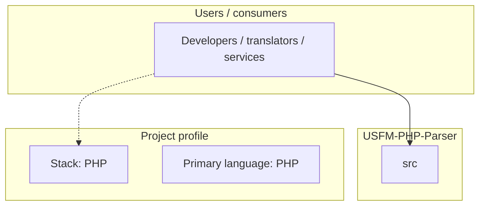
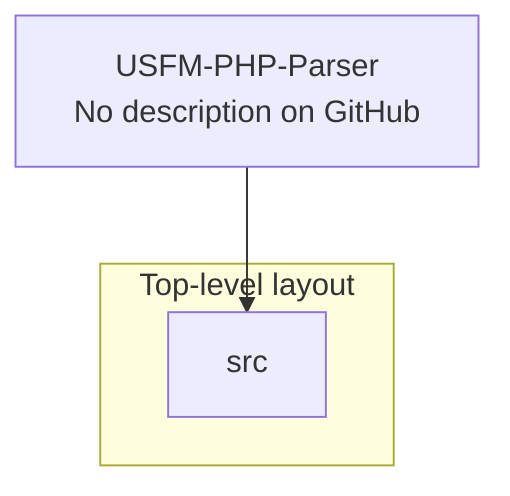

# USFM-PHP-Parser architecture

[WycliffeAssociates/USFM-PHP-Parser](https://github.com/WycliffeAssociates/USFM-PHP-Parser) — _no GitHub description_.

A USFM parser component that was ported from [USFMToolsSharp](https://github.com/WycliffeAssociates/USFMToolsSharp)

## System context

## Repository structure

**Directories:** `src`

**Notable files:** `.gitignore`, `composer.json`, `composer.lock`, `LICENSE`, `README.md`

## Runtime / integration sketch

> This diagram is inferred from repository layout, languages, and README. It is a starting map, not a full design review.

## Languages

| Language | Approx. file count |
|----------|-------------------|
| PHP | 161 files |

## Design notes

| Topic | Detail |
|--------|--------|
| **Stack** | PHP |
| **Default branch** | `master` |
| **Org** | WycliffeAssociates |

## Related

- Source: [WycliffeAssociates/USFM-PHP-Parser](https://github.com/WycliffeAssociates/USFM-PHP-Parser)
- Branch analyzed: `master`
