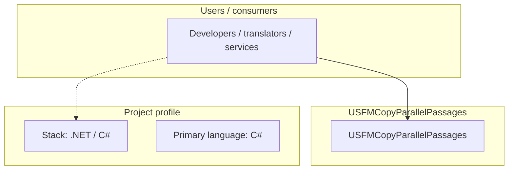
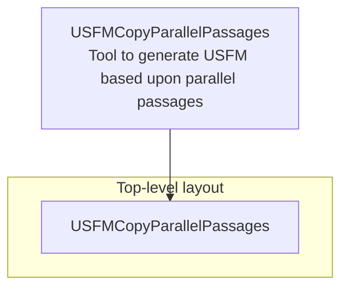
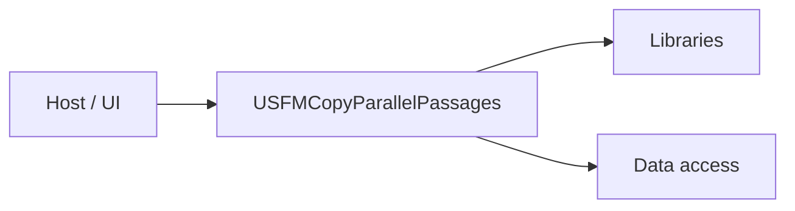

# USFMCopyParallelPassages architecture

[WycliffeAssociates/USFMCopyParallelPassages](https://github.com/WycliffeAssociates/USFMCopyParallelPassages) — Tool to generate USFM based upon parallel passages.

Tool to generate USFM based upon parallel passages

## System context

## Repository structure

**Directories:** `USFMCopyParallelPassages`

**Notable files:** `.gitignore`, `LICENSE`, `USFMCopyParallelPassages.sln`

## Runtime / integration sketch

> This diagram is inferred from repository layout, languages, and README. It is a starting map, not a full design review.

## Languages

| Language | Approx. file count |
|----------|-------------------|
| C# | 7 files |

## Design notes

| Topic | Detail |
|--------|--------|
| **Stack** | .NET / C# |
| **Default branch** | `master` |
| **Org** | WycliffeAssociates |

## Related

- Source: [WycliffeAssociates/USFMCopyParallelPassages](https://github.com/WycliffeAssociates/USFMCopyParallelPassages)
- Branch analyzed: `master`
