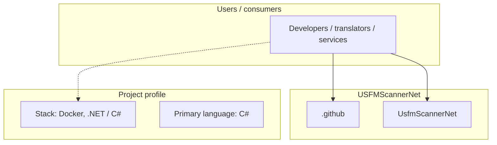
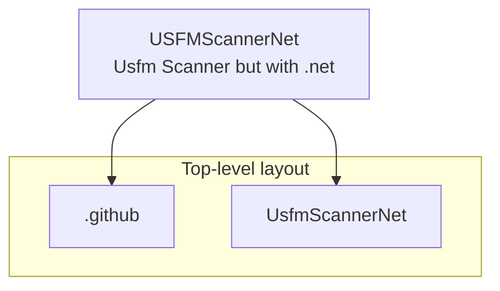
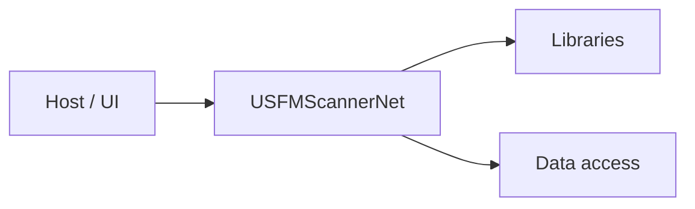

# USFMScannerNet architecture

[WycliffeAssociates/USFMScannerNet](https://github.com/WycliffeAssociates/USFMScannerNet) — Usfm Scanner but with .net.

UsfmScannerNet is a .NET service that scans repositories for USFM (Unified Standard Format Markers) files, used primarily in Bible translation projects. It processes incoming messages from Azure Service Bus, downloads and extracts repositories, converts BTT Writer projects to USFM if necessary, scans the content using a Python-based USFM verification tool, and uploads the linting results to Azure Blob Storage.

## System context

## Repository structure

**Directories:** `.github`, `UsfmScannerNet`

**Notable files:** `.dockerignore`, `.gitignore`, `.gitmodules`, `docker-compose.yml`, `ErrorCodes.csv`, `LICENSE`, `README.md`, `UsfmScannerNet.sln`

## Runtime / integration sketch

> This diagram is inferred from repository layout, languages, and README. It is a starting map, not a full design review.

## Languages

| Language | Approx. file count |
|----------|-------------------|
| C# | 4 files |
| Python | 1 files |
| YAML | 1 files |

## Design notes

| Topic | Detail |
|--------|--------|
| **Stack** | Docker, .NET / C# |
| **Default branch** | `master` |
| **Org** | WycliffeAssociates |

## Related

- Source: [WycliffeAssociates/USFMScannerNet](https://github.com/WycliffeAssociates/USFMScannerNet)
- Branch analyzed: `master`
