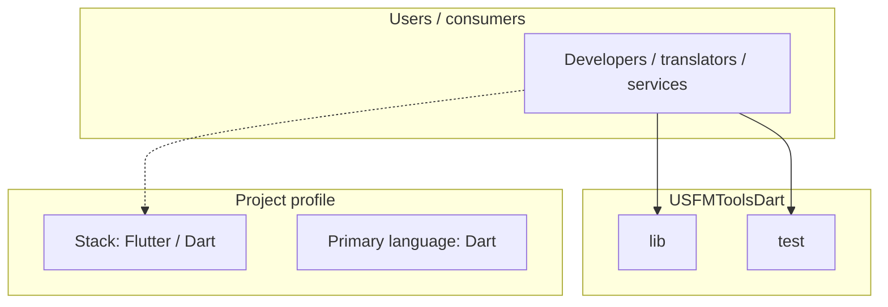
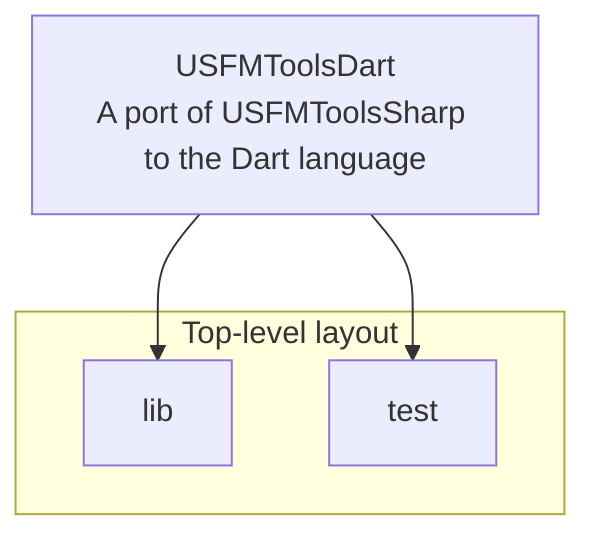

# USFMToolsDart architecture

[WycliffeAssociates/USFMToolsDart](https://github.com/WycliffeAssociates/USFMToolsDart) — A port of USFMToolsSharp to the Dart language.

A port of USFMToolsSharp to the Dart language

## System context

## Repository structure

**Directories:** `lib`, `test`

**Notable files:** `.gitignore`, `analysis_options.yaml`, `LICENSE`, `pubspec.yaml`, `README.md`

## Runtime / integration sketch

> This diagram is inferred from repository layout, languages, and README. It is a starting map, not a full design review.

## Languages

| Language | Approx. file count |
|----------|-------------------|
| Dart | 6 files |
| YAML | 2 files |

## Design notes

| Topic | Detail |
|--------|--------|
| **Stack** | Flutter / Dart |
| **Default branch** | `master` |
| **Org** | WycliffeAssociates |

## Related

- Source: [WycliffeAssociates/USFMToolsDart](https://github.com/WycliffeAssociates/USFMToolsDart)
- Branch analyzed: `master`
