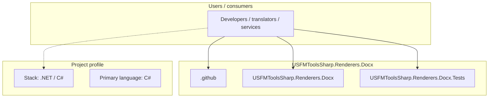
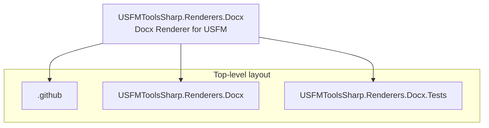
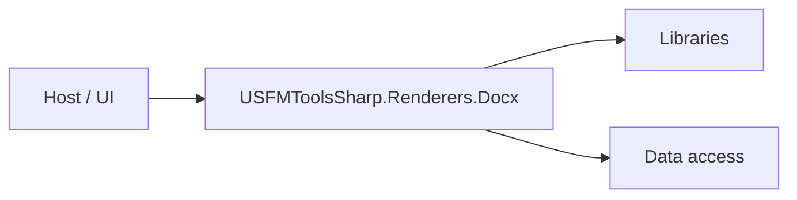

# USFMToolsSharp.Renderers.Docx architecture

[WycliffeAssociates/USFMToolsSharp.Renderers.Docx](https://github.com/WycliffeAssociates/USFMToolsSharp.Renderers.Docx) — Docx Renderer for USFM.

A .net Docx rendering tool for USFM.

## System context

## Repository structure

**Directories:** `.github`, `USFMToolsSharp.Renderers.Docx`, `USFMToolsSharp.Renderers.Docx.Tests`

**Notable files:** `.gitattributes`, `.gitignore`, `.travis.yml`, `LICENSE`, `README.md`, `USFMToolsSharp.Renderers.Docx.sln`

## Runtime / integration sketch

> This diagram is inferred from repository layout, languages, and README. It is a starting map, not a full design review.

## Languages

| Language | Approx. file count |
|----------|-------------------|
| C# | 11 files |

## Design notes

| Topic | Detail |
|--------|--------|
| **Stack** | .NET / C# |
| **Default branch** | `develop` |
| **Org** | WycliffeAssociates |

## Related

- Source: [WycliffeAssociates/USFMToolsSharp.Renderers.Docx](https://github.com/WycliffeAssociates/USFMToolsSharp.Renderers.Docx)
- Branch analyzed: `develop`
