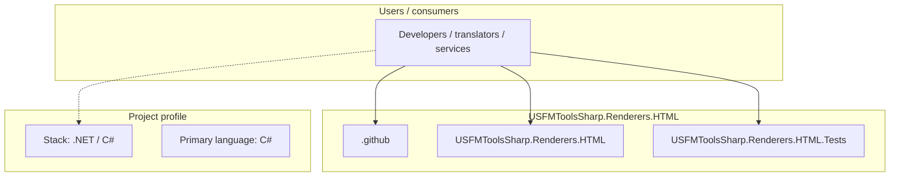
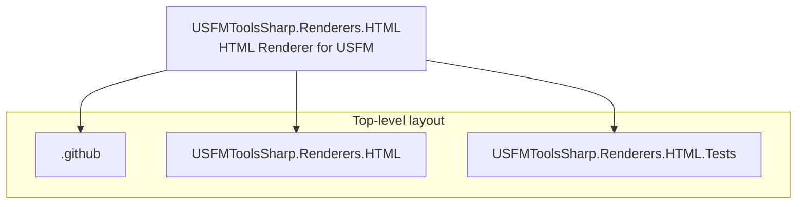
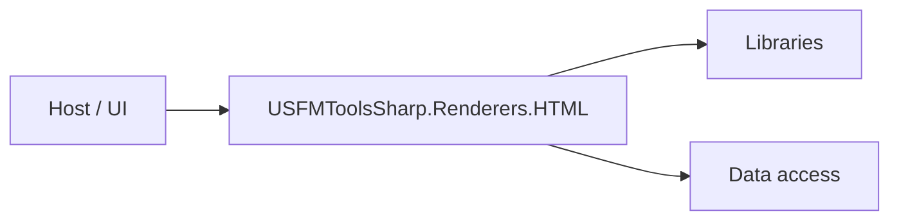

# USFMToolsSharp.Renderers.HTML architecture

[WycliffeAssociates/USFMToolsSharp.Renderers.HTML](https://github.com/WycliffeAssociates/USFMToolsSharp.Renderers.HTML) — HTML Renderer for USFM.

A .net HTML rendering tool for USFM.

## System context

## Repository structure

**Directories:** `.github`, `USFMToolsSharp.Renderers.HTML`, `USFMToolsSharp.Renderers.HTML.Tests`

**Notable files:** `.gitignore`, `LICENSE`, `README.md`, `style.css`, `USFMToolsSharp.Renderers.HTML.sln`

## Runtime / integration sketch

> This diagram is inferred from repository layout, languages, and README. It is a starting map, not a full design review.

## Languages

| Language | Approx. file count |
|----------|-------------------|
| C# | 3 files |
| CSS | 1 files |

## Design notes

| Topic | Detail |
|--------|--------|
| **Stack** | .NET / C# |
| **Default branch** | `master` |
| **Org** | WycliffeAssociates |

## Related

- Source: [WycliffeAssociates/USFMToolsSharp.Renderers.HTML](https://github.com/WycliffeAssociates/USFMToolsSharp.Renderers.HTML)
- Branch analyzed: `master`
