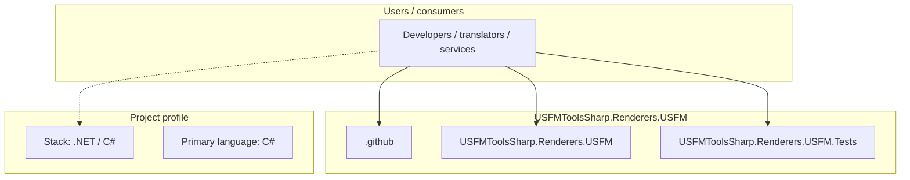
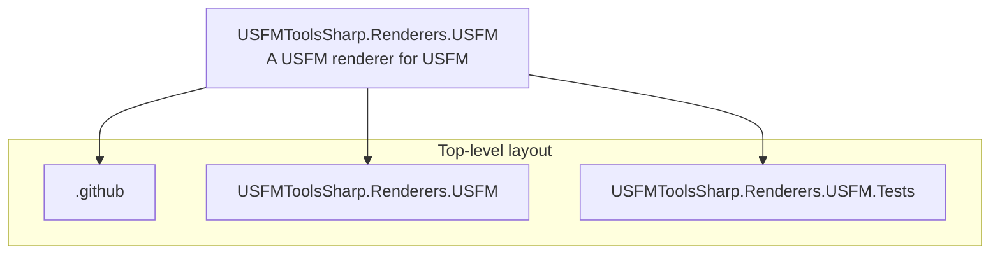
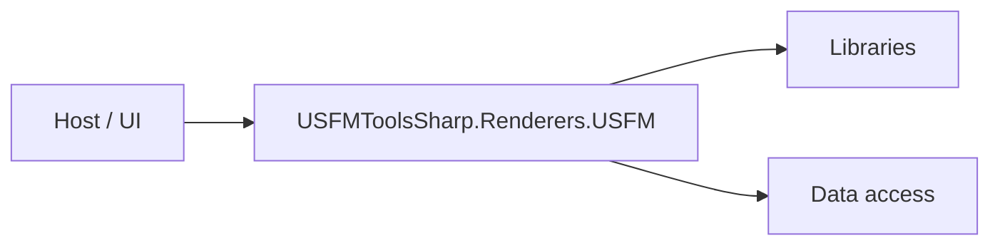

# USFMToolsSharp.Renderers.USFM architecture

[WycliffeAssociates/USFMToolsSharp.Renderers.USFM](https://github.com/WycliffeAssociates/USFMToolsSharp.Renderers.USFM) — A USFM renderer for USFM.

A USFM renderer for USFM

## System context

## Repository structure

**Directories:** `.github`, `USFMToolsSharp.Renderers.USFM`, `USFMToolsSharp.Renderers.USFM.Tests`

**Notable files:** `.gitignore`, `LICENSE`, `README.md`, `USFMToolsSharp.Renderers.USFM.sln`

## Runtime / integration sketch

> This diagram is inferred from repository layout, languages, and README. It is a starting map, not a full design review.

## Languages

| Language | Approx. file count |
|----------|-------------------|
| C# | 2 files |

## Design notes

| Topic | Detail |
|--------|--------|
| **Stack** | .NET / C# |
| **Default branch** | `master` |
| **Org** | WycliffeAssociates |

## Related

- Source: [WycliffeAssociates/USFMToolsSharp.Renderers.USFM](https://github.com/WycliffeAssociates/USFMToolsSharp.Renderers.USFM)
- Branch analyzed: `master`
