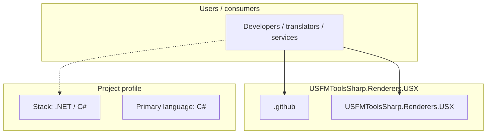
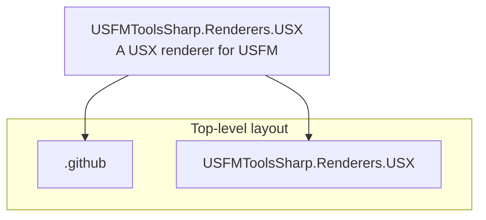
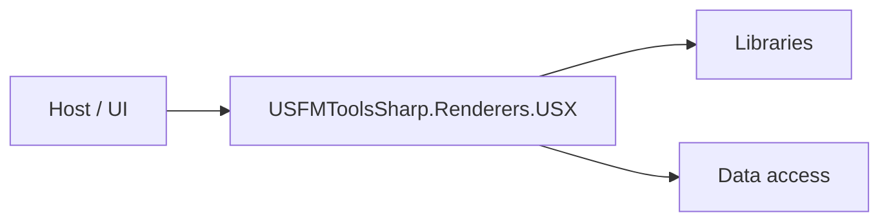

# USFMToolsSharp.Renderers.USX architecture

[WycliffeAssociates/USFMToolsSharp.Renderers.USX](https://github.com/WycliffeAssociates/USFMToolsSharp.Renderers.USX) — A USX renderer for USFM.

A USX (Unified Scripture XML) renderer for USFM (Unified Standard Format Markers) documents. This library converts USFM formatted scripture text into valid USX XML format, supporting both USX 2.5 and 3.0 specifications.

## System context

## Repository structure

**Directories:** `.github`, `USFMToolsSharp.Renderers.USX`

**Notable files:** `.gitignore`, `LICENSE`, `README.md`, `USFMToolsSharp.Renderers.USX.sln`

## Runtime / integration sketch

> This diagram is inferred from repository layout, languages, and README. It is a starting map, not a full design review.

## Languages

| Language | Approx. file count |
|----------|-------------------|
| C# | 3 files |

## Design notes

| Topic | Detail |
|--------|--------|
| **Stack** | .NET / C# |
| **Default branch** | `master` |
| **Org** | WycliffeAssociates |

## Related

- Source: [WycliffeAssociates/USFMToolsSharp.Renderers.USX](https://github.com/WycliffeAssociates/USFMToolsSharp.Renderers.USX)
- Branch analyzed: `master`
