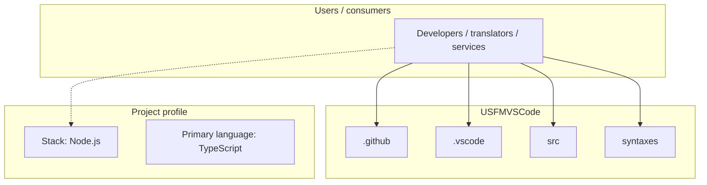
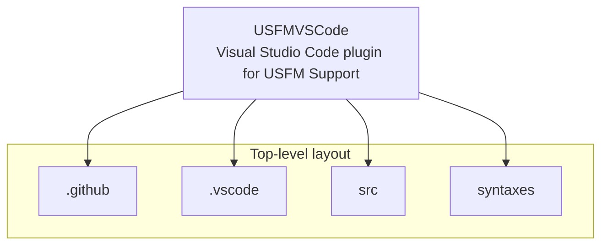
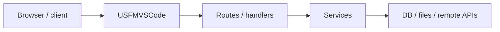

# USFMVSCode architecture

[WycliffeAssociates/USFMVSCode](https://github.com/WycliffeAssociates/USFMVSCode) — Visual Studio Code plugin for USFM Support.

A Visual Studio Code Plugin to provide support for USFM

## System context

## Repository structure

**Directories:** `.github`, `.vscode`, `src`, `syntaxes`

**Notable files:** `.eslintrc.json`, `.gitattributes`, `.gitignore`, `.vscodeignore`, `CHANGELOG.md`, `LICENSE`, `package-lock.json`, `package.json`, `README.md`, `tsconfig.json`, `webpack.config.js`

## Runtime / integration sketch

> This diagram is inferred from repository layout, languages, and README. It is a starting map, not a full design review.

## Languages

| Language | Approx. file count |
|----------|-------------------|
| TypeScript | 13 files |
| JavaScript | 1 files |

## Design notes

| Topic | Detail |
|--------|--------|
| **Stack** | Node.js |
| **Default branch** | `master` |
| **Org** | WycliffeAssociates |

## Related

- Source: [WycliffeAssociates/USFMVSCode](https://github.com/WycliffeAssociates/USFMVSCode)
- Branch analyzed: `master`
