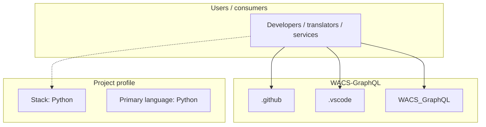
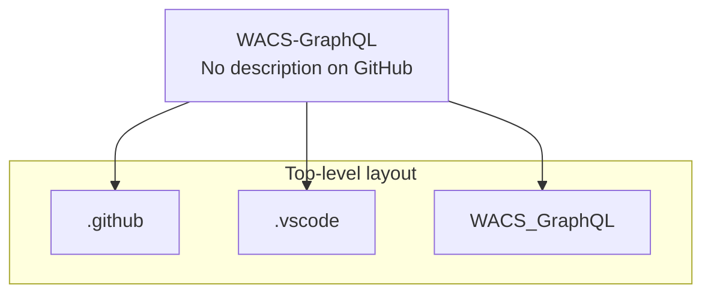
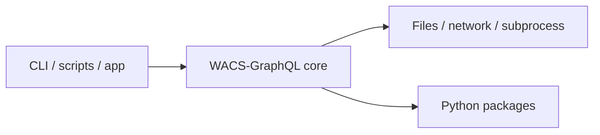

# WACS-GraphQL architecture

[WycliffeAssociates/WACS-GraphQL](https://github.com/WycliffeAssociates/WACS-GraphQL) — _no GitHub description_.

WACS-GraphQL is a public repository under WycliffeAssociates.

## System context

## Repository structure

**Directories:** `.github`, `.vscode`, `WACS_GraphQL`

**Notable files:** `.funcignore`, `.gitignore`, `getting_started.md`, `host.json`, `makefile`, `requirements.txt`

## Runtime / integration sketch

> This diagram is inferred from repository layout, languages, and README. It is a starting map, not a full design review.

## Languages

| Language | Approx. file count |
|----------|-------------------|
| Python | 1 files |

## Design notes

| Topic | Detail |
|--------|--------|
| **Stack** | Python |
| **Default branch** | `main` |
| **Org** | WycliffeAssociates |

## Related

- Source: [WycliffeAssociates/WACS-GraphQL](https://github.com/WycliffeAssociates/WACS-GraphQL)
- Branch analyzed: `main`
