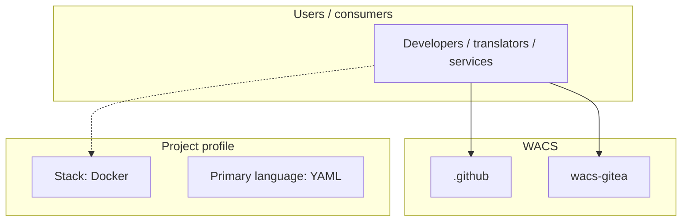
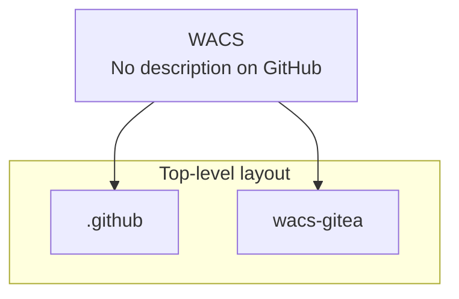
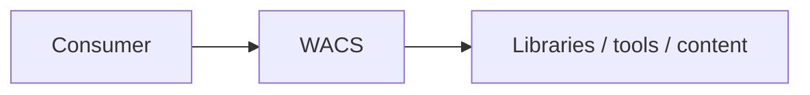

# WACS architecture

[WycliffeAssociates/WACS](https://github.com/WycliffeAssociates/WACS) — _no GitHub description_.

This project is UI customizations for WA's Gitea instance.

## System context

## Repository structure

**Directories:** `.github`, `wacs-gitea`

**Notable files:** `.env`, `.gitignore`, `deploy.sh`, `docker-compose.util.yml`, `docker-compose.yml`, `makefile`, `README.md`, `token-trigger.sql`

## Runtime / integration sketch

> This diagram is inferred from repository layout, languages, and README. It is a starting map, not a full design review.

## Languages

| Language | Approx. file count |
|----------|-------------------|
| YAML | 2 files |
| Shell | 1 files |
| SQL | 1 files |
| JavaScript | 1 files |
| CSS | 1 files |
| Go | 1 files |

## Design notes

| Topic | Detail |
|--------|--------|
| **Stack** | Docker |
| **Default branch** | `prod` |
| **Org** | WycliffeAssociates |

## Related

- Source: [WycliffeAssociates/WACS](https://github.com/WycliffeAssociates/WACS)
- Branch analyzed: `prod`
