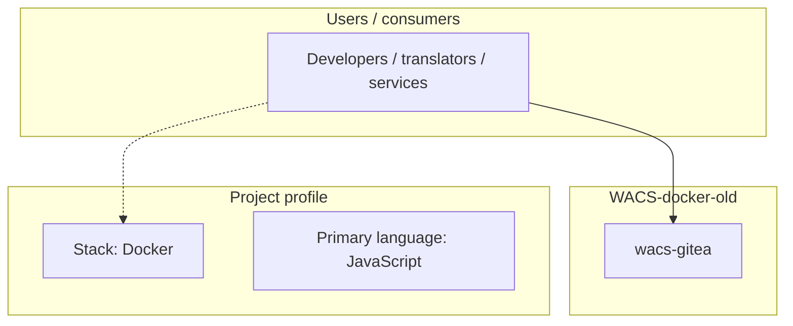
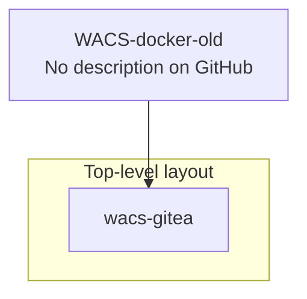
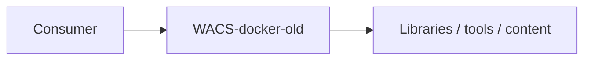

# WACS-docker-old architecture

[WycliffeAssociates/WACS-docker-old](https://github.com/WycliffeAssociates/WACS-docker-old) — _no GitHub description_.

This project is UI customizations for WA's Gitea instance. The files here were forked from [Gitea](https://github.com/go-gitea/gitea) and [Gogs](https://gogs.io).

## System context

## Repository structure

**Directories:** `wacs-gitea`

**Notable files:** `.env`, `.gitignore`, `app.ini`, `build.sh`, `DCO`, `deploy.sh`, `docker-compose.override.yml`, `docker-compose.yml`, `LICENSE`, `makefile`, `README.md`

## Runtime / integration sketch

> This diagram is inferred from repository layout, languages, and README. It is a starting map, not a full design review.

## Languages

| Language | Approx. file count |
|----------|-------------------|
| JavaScript | 176 files |
| HTML | 132 files |
| CSS | 15 files |
| YAML | 3 files |
| Shell | 2 files |

## Design notes

| Topic | Detail |
|--------|--------|
| **Stack** | Docker |
| **Default branch** | `dev` |
| **Org** | WycliffeAssociates |

## Related

- Source: [WycliffeAssociates/WACS-docker-old](https://github.com/WycliffeAssociates/WACS-docker-old)
- Branch analyzed: `dev`
