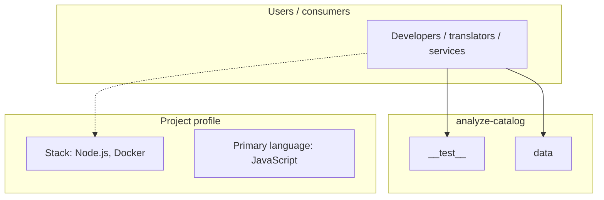
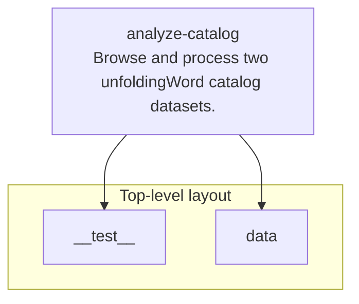
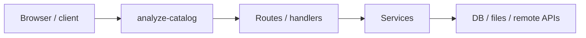

# analyze-catalog architecture

[WycliffeAssociates/analyze-catalog](https://github.com/WycliffeAssociates/analyze-catalog) — Browse and process two unfoldingWord catalog datasets..

Browse and process two unfoldingWord catalog datasets.

## System context

## Repository structure

**Directories:** `__test__`, `data`

**Notable files:** `.dockerignore`, `.eslintrc.js`, `.gitignore`, `compare.js`, `Dockerfile`, `entrypoint.sh`, `functions.js`, `helpers.js`, `index.js`, `makefile`, `package-lock.json`, `package.json`, `readme.MD`

## Runtime / integration sketch

> This diagram is inferred from repository layout, languages, and README. It is a starting map, not a full design review.

## Languages

| Language | Approx. file count |
|----------|-------------------|
| JavaScript | 6 files |
| Shell | 1 files |

## Design notes

| Topic | Detail |
|--------|--------|
| **Stack** | Node.js, Docker |
| **Default branch** | `master` |
| **Org** | WycliffeAssociates |

## Related

- Source: [WycliffeAssociates/analyze-catalog](https://github.com/WycliffeAssociates/analyze-catalog)
- Branch analyzed: `master`
