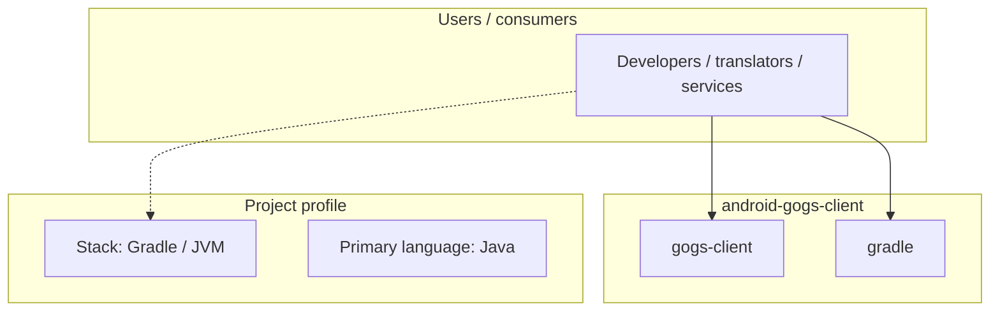
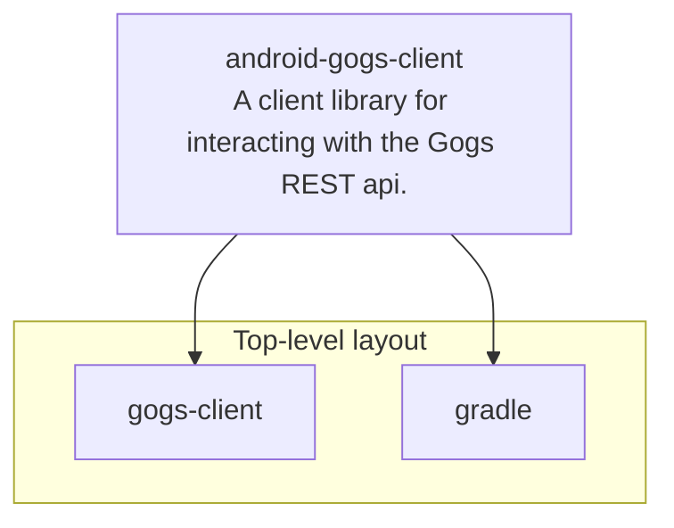
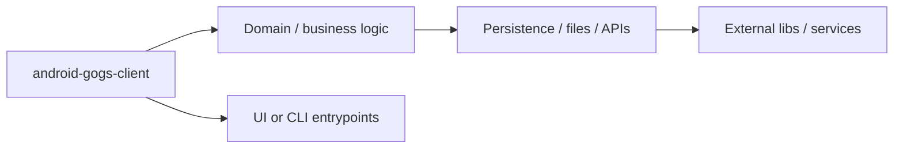

# android-gogs-client architecture

[WycliffeAssociates/android-gogs-client](https://github.com/WycliffeAssociates/android-gogs-client) — A client library for interacting with the Gogs REST api..

A client library for interacting with the [Gogs](https://gogs.io) REST api. This library is written to communicate according to the api defined in [gogits/go-gogs-client](https://github.com/gogits/go-gogs-client/wiki).

## System context

## Repository structure

**Directories:** `gogs-client`, `gradle`

**Notable files:** `.gitignore`, `.travis.yml`, `android-gogs-client.iml`, `build.gradle`, `config.json.enc`, `DEPLOYING`, `gradle.properties`, `gradlew`, `gradlew.bat`, `LICENSE`, `README.md`, `settings.gradle`

## Runtime / integration sketch

> This diagram is inferred from repository layout, languages, and README. It is a starting map, not a full design review.

## Languages

| Language | Approx. file count |
|----------|-------------------|
| Java | 9 files |
| Gradle | 3 files |
| XML | 2 files |
| Batch | 1 files |

## Design notes

| Topic | Detail |
|--------|--------|
| **Stack** | Gradle / JVM |
| **Default branch** | `master` |
| **Org** | WycliffeAssociates |

## Related

- Source: [WycliffeAssociates/android-gogs-client](https://github.com/WycliffeAssociates/android-gogs-client)
- Branch analyzed: `master`
