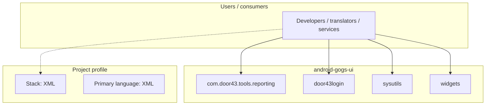
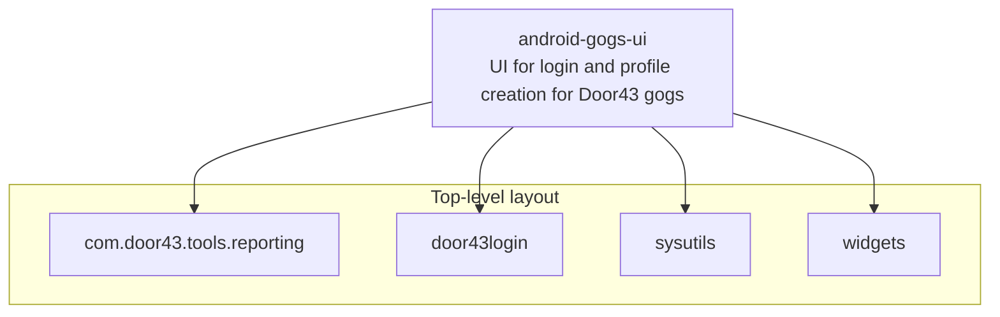
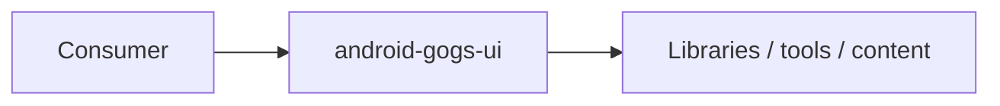

# android-gogs-ui architecture

[WycliffeAssociates/android-gogs-ui](https://github.com/WycliffeAssociates/android-gogs-ui) — UI for login and profile creation for Door43 gogs.

UI for login and profile creation for Door43 gogs

## System context

## Repository structure

**Directories:** `com.door43.tools.reporting`, `door43login`, `sysutils`, `widgets`

**Notable files:** `.gitignore`, `COPYING`, `LICENSE`, `README.md`

## Runtime / integration sketch

> This diagram is inferred from repository layout, languages, and README. It is a starting map, not a full design review.

## Languages

| Language | Approx. file count |
|----------|-------------------|
| XML | 35 files |
| Java | 34 files |
| Gradle | 4 files |

## Design notes

| Topic | Detail |
|--------|--------|
| **Stack** | XML |
| **Default branch** | `master` |
| **Org** | WycliffeAssociates |

## Related

- Source: [WycliffeAssociates/android-gogs-ui](https://github.com/WycliffeAssociates/android-gogs-ui)
- Branch analyzed: `master`
