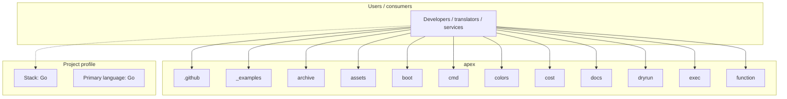
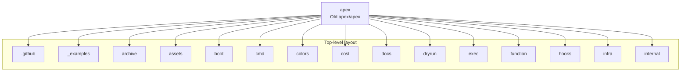
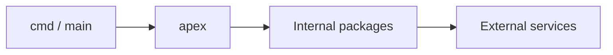

# apex architecture

[WycliffeAssociates/apex](https://github.com/WycliffeAssociates/apex) — Old apex/apex.

This software is no longer being maintainted and should not be chosen for new projects. See this [issue](https://github.com/apex/apex/issues/932) for more information

## System context

## Repository structure

**Directories:** `.github`, `_examples`, `archive`, `assets`, `boot`, `cmd`, `colors`, `cost`, `docs`, `dryrun`, `exec`, `function`, `hooks`, `infra`, `internal`, `logs`, `metrics`, `mock`, `plugins`, `project`, `service`, `shim`, `upgrade`, `utils`, `vpc`

**Notable files:** `.gitignore`, `.goreleaser.yml`, `CODE_OF_CONDUCT.md`, `CONTRIBUTING.md`, `go.mod`, `go.sum`, `History.md`, `install.sh`, `LICENSE`, `Makefile`, `Readme.md`

## Runtime / integration sketch

> This diagram is inferred from repository layout, languages, and README. It is a starting map, not a full design review.

## Languages

| Language | Approx. file count |
|----------|-------------------|
| Go | 66 files |
| JavaScript | 33 files |
| Python | 3 files |
| Gradle | 2 files |
| Java | 2 files |
| Ruby | 2 files |
| Groovy | 1 files |
| XML | 1 files |

## Design notes

| Topic | Detail |
|--------|--------|
| **Stack** | Go |
| **Default branch** | `master` |
| **Org** | WycliffeAssociates |

## Related

- Source: [WycliffeAssociates/apex](https://github.com/WycliffeAssociates/apex)
- Branch analyzed: `master`
