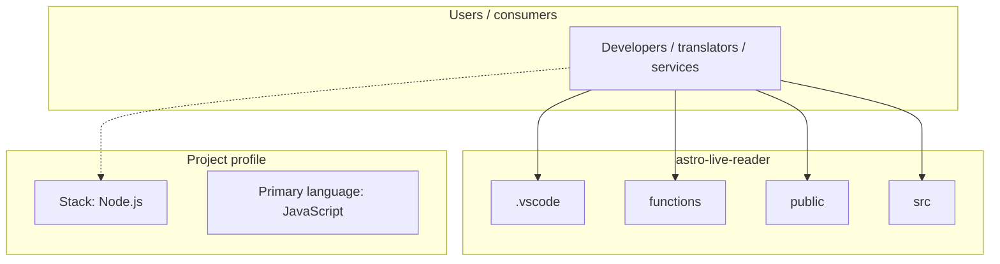
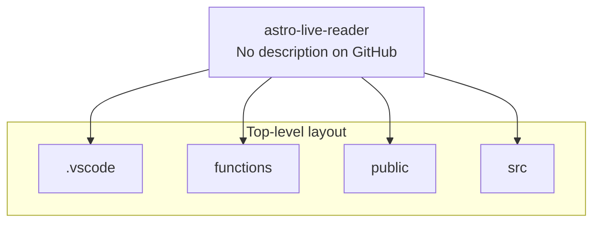
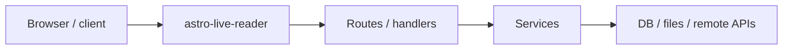

# astro-live-reader architecture

[WycliffeAssociates/astro-live-reader](https://github.com/WycliffeAssociates/astro-live-reader) — _no GitHub description_.

> 🧑‍🚀 **Seasoned astronaut?** Delete this file. Have fun!

## System context

## Repository structure

**Directories:** `.vscode`, `functions`, `public`, `src`

**Notable files:** `.dockerignore`, `.gitignore`, `.npmrc`, `astro.config.mjs`, `chinook.db`, `manifest.ts`, `package.json`, `pnpm-lock.yaml`, `README.md`, `tailwind.config.cjs`, `tsconfig.json`

## Runtime / integration sketch

> This diagram is inferred from repository layout, languages, and README. It is a starting map, not a full design review.

## Languages

| Language | Approx. file count |
|----------|-------------------|
| JavaScript | 9 files |
| TypeScript | 3 files |
| YAML | 1 files |

## Design notes

| Topic | Detail |
|--------|--------|
| **Stack** | Node.js |
| **Default branch** | `master` |
| **Org** | WycliffeAssociates |

## Related

- Source: [WycliffeAssociates/astro-live-reader](https://github.com/WycliffeAssociates/astro-live-reader)
- Branch analyzed: `master`
