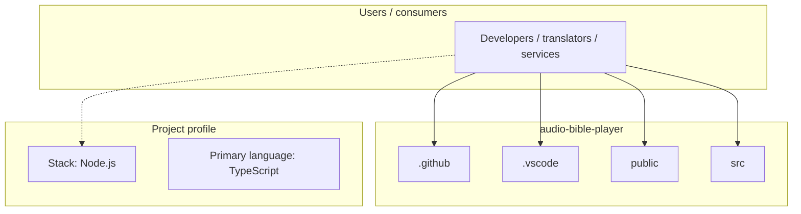
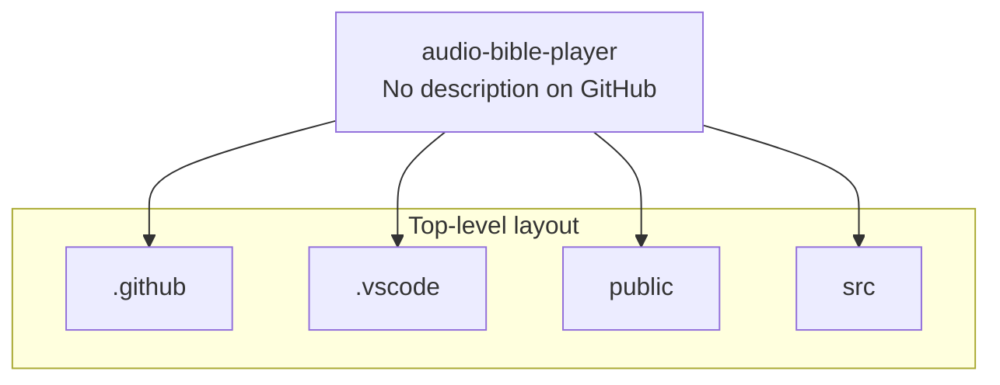

# audio-bible-player architecture

[WycliffeAssociates/audio-bible-player](https://github.com/WycliffeAssociates/audio-bible-player) — _no GitHub description_.

audio-bible-player is a public repository under WycliffeAssociates.

## System context

## Repository structure

**Directories:** `.github`, `.vscode`, `public`, `src`

**Notable files:** `.gitignore`, `astro.config.ts`, `package.json`, `pnpm-lock.yaml`, `README.md`, `tsconfig.json`

## Runtime / integration sketch

> This diagram is inferred from repository layout, languages, and README. It is a starting map, not a full design review.

## Languages

| Language | Approx. file count |
|----------|-------------------|
| TypeScript | 13 files |
| YAML | 1 files |
| JavaScript | 1 files |

## Design notes

| Topic | Detail |
|--------|--------|
| **Stack** | Node.js |
| **Default branch** | `prod` |
| **Org** | WycliffeAssociates |

## Related

- Source: [WycliffeAssociates/audio-bible-player](https://github.com/WycliffeAssociates/audio-bible-player)
- Branch analyzed: `prod`
