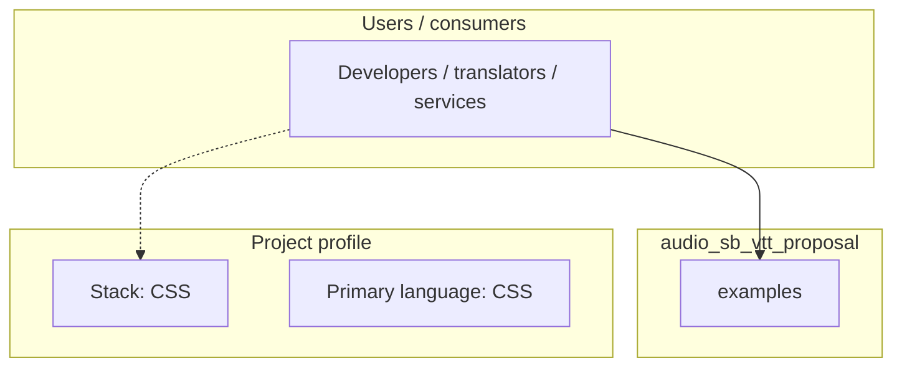
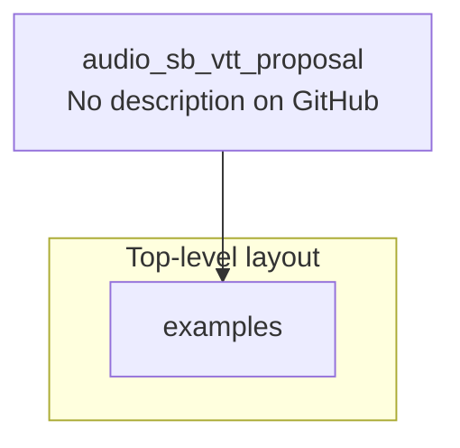

# audio_sb_vtt_proposal architecture

[WycliffeAssociates/audio_sb_vtt_proposal](https://github.com/WycliffeAssociates/audio_sb_vtt_proposal) — _no GitHub description_.

The following repo contains examples of a proposed timing file format using u23003 Biblical References as semantic tags.

## System context

## Repository structure

**Directories:** `examples`

**Notable files:** `.gitattributes`, `LICENSE`, `README.md`

## Runtime / integration sketch

> This diagram is inferred from repository layout, languages, and README. It is a starting map, not a full design review.

## Languages

| Language | Approx. file count |
|----------|-------------------|
| CSS | 1 files |

## Design notes

| Topic | Detail |
|--------|--------|
| **Stack** | CSS |
| **Default branch** | `u23003` |
| **Org** | WycliffeAssociates |

## Related

- Source: [WycliffeAssociates/audio_sb_vtt_proposal](https://github.com/WycliffeAssociates/audio_sb_vtt_proposal)
- Branch analyzed: `u23003`
