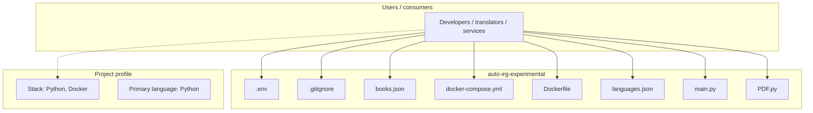
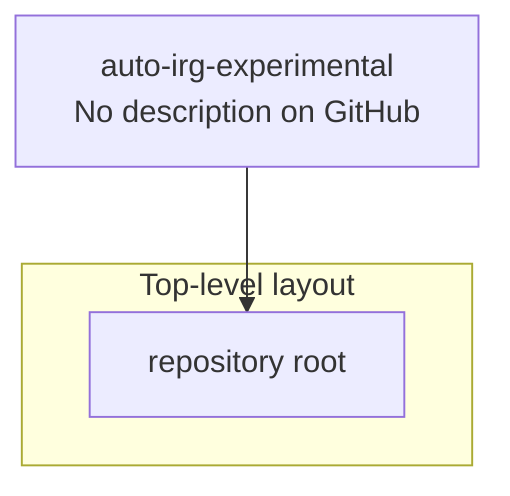
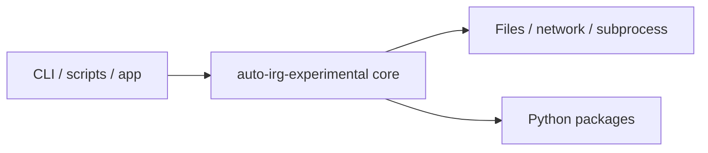

# auto-irg-experimental architecture

[WycliffeAssociates/auto-irg-experimental](https://github.com/WycliffeAssociates/auto-irg-experimental) — _no GitHub description_.

auto-irg-experimental is a public repository under WycliffeAssociates.

## System context

## Repository structure

**Notable files:** `.env`, `.gitignore`, `books.json`, `docker-compose.yml`, `Dockerfile`, `languages.json`, `main.py`, `PDF.py`, `README.md`, `requirements.txt`, `Resources.py`

## Runtime / integration sketch

> This diagram is inferred from repository layout, languages, and README. It is a starting map, not a full design review.

## Languages

| Language | Approx. file count |
|----------|-------------------|
| Python | 3 files |
| YAML | 1 files |

## Design notes

| Topic | Detail |
|--------|--------|
| **Stack** | Python, Docker |
| **Default branch** | `dev` |
| **Org** | WycliffeAssociates |

## Related

- Source: [WycliffeAssociates/auto-irg-experimental](https://github.com/WycliffeAssociates/auto-irg-experimental)
- Branch analyzed: `dev`
