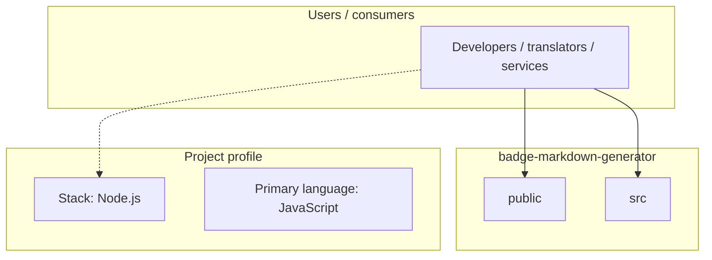
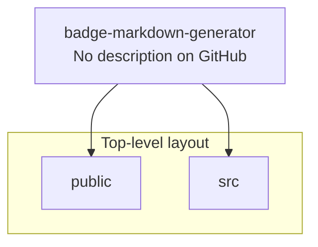
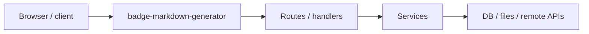

# badge-markdown-generator architecture

[WycliffeAssociates/badge-markdown-generator](https://github.com/WycliffeAssociates/badge-markdown-generator) — _no GitHub description_.

This project was bootstrapped with [Create React App](https://github.com/facebookincubator/create-react-app).

## System context

## Repository structure

**Directories:** `public`, `src`

**Notable files:** `.gitignore`, `package.json`, `README.md`, `yarn.lock`

## Runtime / integration sketch

> This diagram is inferred from repository layout, languages, and README. It is a starting map, not a full design review.

## Languages

| Language | Approx. file count |
|----------|-------------------|
| JavaScript | 3 files |
| CSS | 2 files |
| HTML | 1 files |

## Design notes

| Topic | Detail |
|--------|--------|
| **Stack** | Node.js |
| **Default branch** | `master` |
| **Org** | WycliffeAssociates |

## Related

- Source: [WycliffeAssociates/badge-markdown-generator](https://github.com/WycliffeAssociates/badge-markdown-generator)
- Branch analyzed: `master`
