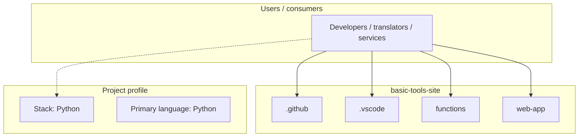
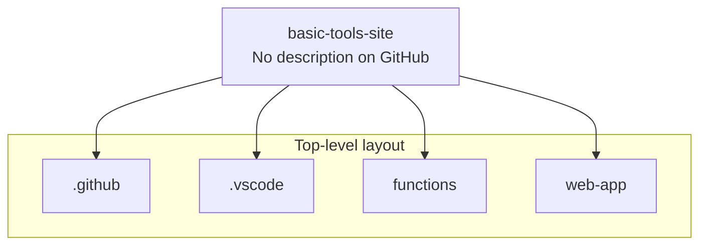
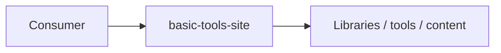

# basic-tools-site architecture

[WycliffeAssociates/basic-tools-site](https://github.com/WycliffeAssociates/basic-tools-site) — _no GitHub description_.

basic-tools-site is a public repository under WycliffeAssociates.

## System context

## Repository structure

**Directories:** `.github`, `.vscode`, `functions`, `web-app`

**Notable files:** `.funcignore`, `.gitignore`, `host.json`

## Runtime / integration sketch

> This diagram is inferred from repository layout, languages, and README. It is a starting map, not a full design review.

## Languages

| Language | Approx. file count |
|----------|-------------------|
| Python | 2 files |
| CSS | 1 files |
| HTML | 1 files |
| JavaScript | 1 files |

## Design notes

| Topic | Detail |
|--------|--------|
| **Stack** | Python |
| **Default branch** | `master` |
| **Org** | WycliffeAssociates |

## Related

- Source: [WycliffeAssociates/basic-tools-site](https://github.com/WycliffeAssociates/basic-tools-site)
- Branch analyzed: `master`
